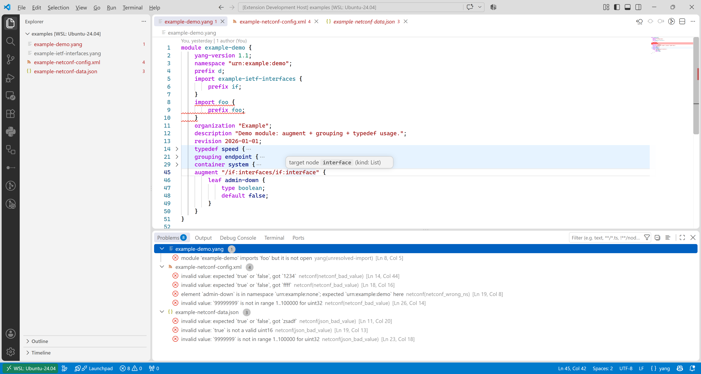
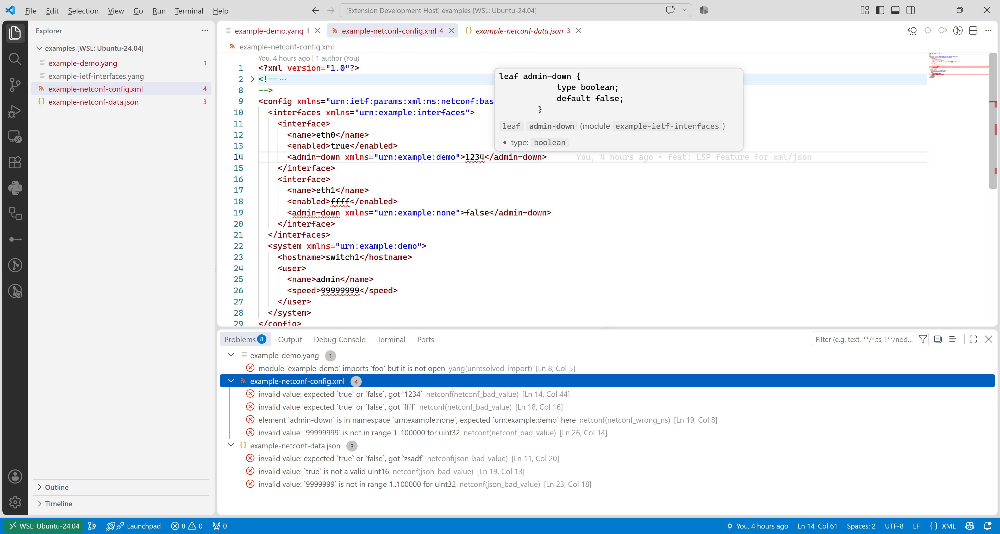
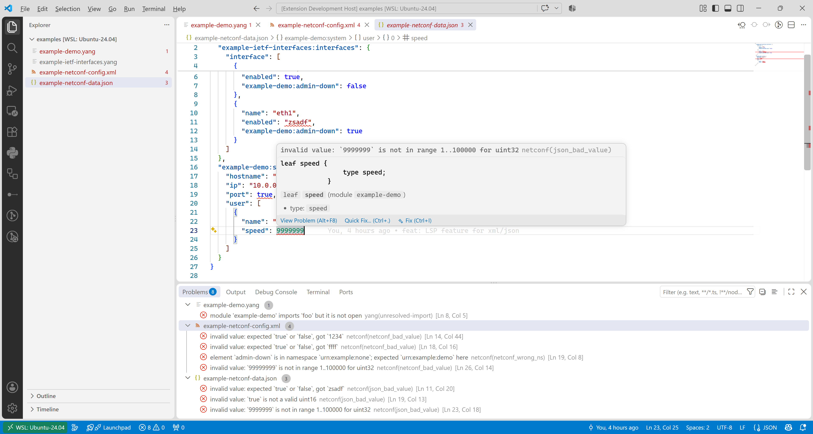
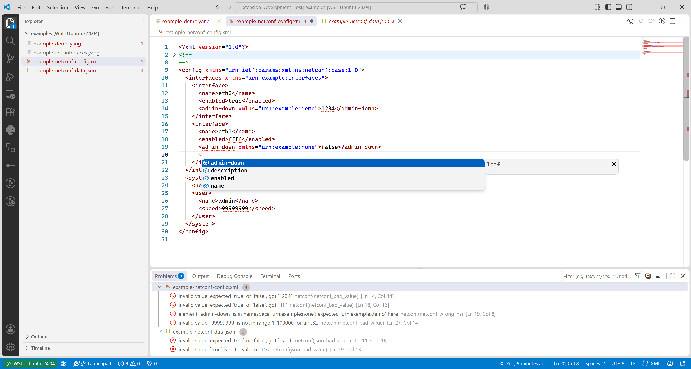
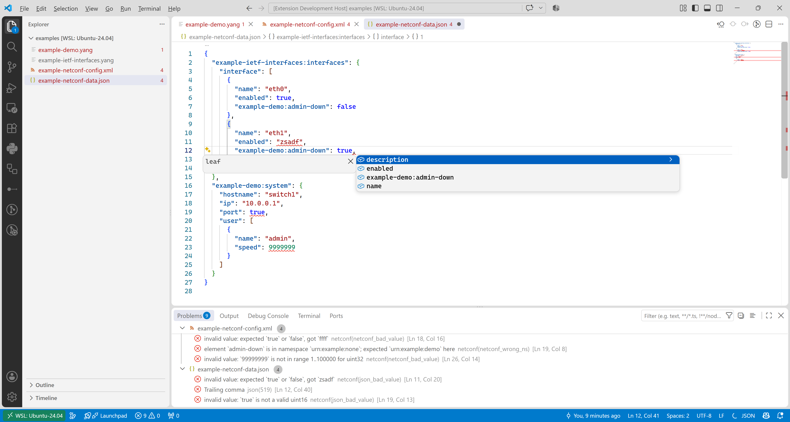
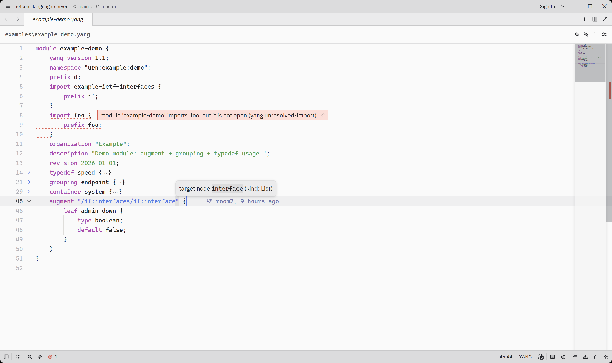
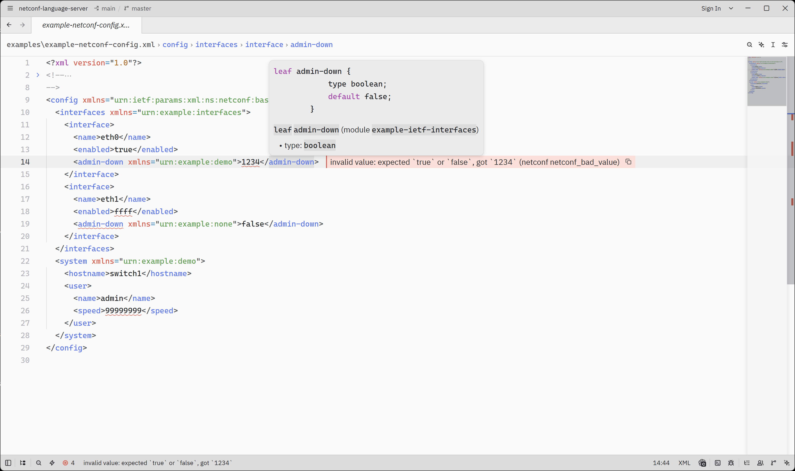
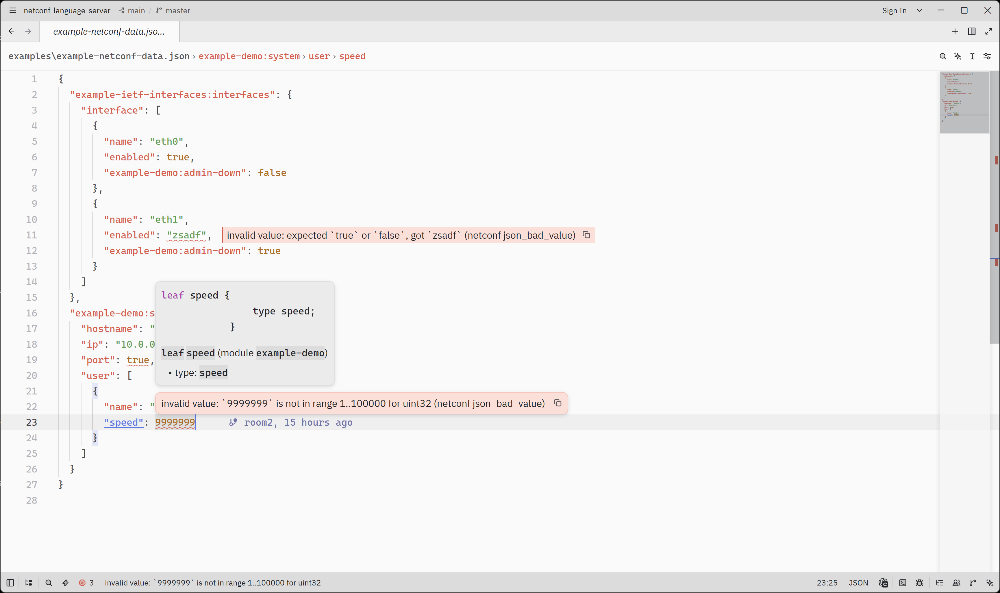
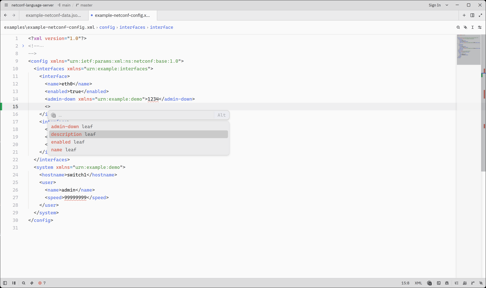
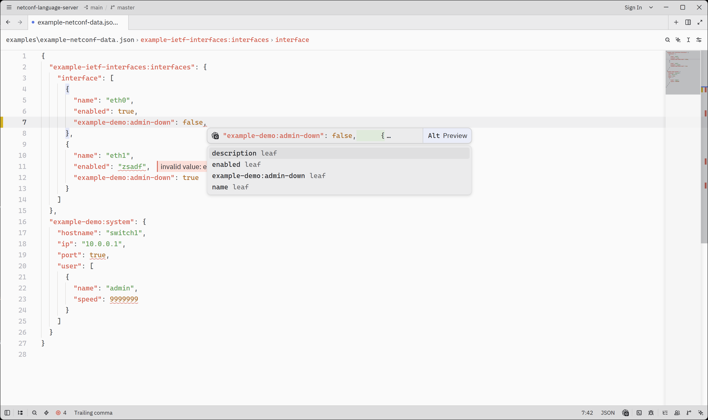

# NETCONF Language Server

[](https://github.com/trislu/netconf-language-server/actions/workflows/rust-ci.yml)
[](https://crates.io/crates/netconf-language-server)
[](LICENSE)
[](https://marketplace.visualstudio.com/items?itemName=k19.netconf)

A [language server](https://microsoft.github.io/language-server-protocol/) for
authoring **NETCONF / YANG** — YANG modules (`*.yang`) and NETCONF **instance
documents** (XML envelopes/payloads and RFC 7951 JSON) — implemented in Rust,
with [VS Code](clients/vscode) and [Zed](clients/zed) extensions.

## Repository layout

- [`src/`](src) — the language server binary (`netconf-language-server`).
  Semantic engine: [`yrepo`](https://github.com/trislu/yrepo) (YANG
  parse/resolve/query + leaf value typing). Grammars: `tree-sitter-yang` (via
  `yrepo`), plus `tree-sitter-xml` / `tree-sitter-json` for instance docs.
- [`clients/vscode`](clients/vscode) — VS Code extension (language ids `yang`,
  `xml`, `json`; settings section `netconf`).
- [`clients/zed`](clients/zed) — Zed extension registering `netconf-language-server`
  for YANG, XML, and JSON.
- [`examples/`](examples) — sample YANG modules plus XML/JSON instance documents
  for manual testing.
- [`docs/architecture.md`](docs/architecture.md) — the design document and
  decision record (D1–D31, incl. the instance-document milestones M0–M5).

## LSP features

### Demo

**VS Code** — the [VS Code extension](clients/vscode). **Read** — diagnostics &
hover — over **YANG**, **XML (NETCONF)**, and **RFC 7951 JSON**:

<p align="center">
  
</p>

<p align="center">
  
</p>

<p align="center">
  
</p>

**Write** — completion on XML elements and JSON members:

<p align="center">
  
</p>

<p align="center">
  
</p>

**Zed** — the [Zed extension](clients/zed). Same **read** (diagnostics & hover)
and **write** (completion) features in the Zed editor:

<p align="center">
  
</p>

<p align="center">
  
</p>

<p align="center">
  
</p>

<p align="center">
  
</p>

<p align="center">
  
</p>

### YANG authoring

| Feature | Status |
| --- | --- |
| Semantic tokens (highlight) | ✅ |
| Statement-level folding | ✅ |
| Document formatting (full-doc) | ✅ |
| Diagnostics (pull, incl. import cycles / conflict prefix) | ✅ |
| Go-to-definition (`LocationLink`) | ✅ |
| Hover (type chains / identity ancestry / prefix bindings) | ✅ |
| Completion (`type` / identity `base`) | ✅ |

### Instance documents (XML / RFC 7951 JSON)

Instance `.xml`/`.json` files are content-sniffed against the compiled modules:
NETCONF/`netconf` docs get the features below; anything unmatched stays dormant.

| Feature | Status |
| --- | --- |
| Intent classification (envelope / config payload / data tree vs dormant) | ✅ (M0) |
| XML read: goto / hover / diagnostics (unknown node, wrong namespace) | ✅ (M1) |
| JSON read: goto / hover / diagnostics (unknown member, wrong module) | ✅ (M3) |
| Diagnostics depth: missing mandatory/key, empty `choice` (XML + JSON) | ✅ (M4) |
| XML write: NETCONF templates (`hello`, `get-config`, `edit-config`, `config`) | ✅ (M2) |
| Completion: XML elements (keys/xmlns) & JSON members (RFC 7951 qualifiers) | ✅ (M2/M4) |
| Leaf *value* validation (scalar-only; `union` silent) + typed defaults | ✅ (M5) |

**Guides:** [LSP features (detailed)](docs/features.md) · [Architecture & decisions](docs/architecture.md)

## Building

```bash
cargo build          # server -> target/debug/netconf-language-server
cargo clippy         # lint
cargo test           # unit + corpus suites
```

VS Code client:

```bash
cd clients/vscode
npm install
npm run compile      # tsc + eslint + esbuild -> dist/extension.js
```

To debug the extension end-to-end (F5 from this repo), `.vscode/launch.json`
runs the Extension Development Host against `target/debug/netconf-language-server` (see
`__DEBUG_LSP_SERVER`) with `examples/` openable as the test workspace.

## Settings

- `netconf.indentSize` (default `4`): spaces per indentation level used by the
  formatter.

## License

MIT — see [`LICENSE`](LICENSE).
