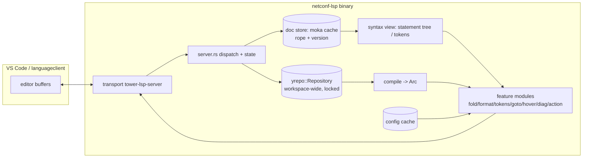

# NETCONF Language Server — Architecture

> Working/evolving design document. Discussion only — no implementation until decided.
> Status markers: **[DECIDE]** = open decision, **[DONE]** = settled, **[ASSUME]** = working assumption to confirm.

## 0. Scope

A Rust language server for authoring **NETCONF/YANG** (`*.yang`) plus a **VS Code** extension.

- Reference implementation skeleton: **`gemcap-language-server`** (MIT — mirror freely).
- Design lessons (concepts only, no code): **`lsp-for-freemarker`** (NOKIA licensed — do not copy).
- Semantic engine: **`yrepo`** (MIT sibling crate, already a path dependency). Grammar: `tree-sitter-yang` (transitively pulled in by `yrepo`).

Original LSP feature spec is preserved and re-mapped in §7–§8.

---

## 1. Layered model



### Responsibilities per crate

| Crate | Owns | Does NOT own |
| --- | --- | --- |
| `netconf-lsp` | LSP transport, document store, feature logic, config, VS Code glue | YANG grammar knowledge, semantic model |
| `yrepo` | parsing, statement/CST model, cross-file compile, symbol tables, effective tree | anything LSP-specific |
| `tree-sitter-yang` | the grammar | — |

**[DONE D2]** `yrepo` (commit `7a5abdf`) now exposes the statement tree publicly:

- `Repository::statement(url) -> Option<&Statement>` — root `module`/`submodule` statement (walk with `Statement::preorder`).
- `Repository::statement_at(url, row, col) -> Option<&Statement>` — narrowest statement under the caret (read `.arg`/`.keyword` directly).
- `Statement`, `Argument`, `StatementEnd` re-exported (`range`/`keyword`/`arg`/`end`/`children` + `is_block`/`body`/`span`/`preorder`).

**[DONE D13-comments]** Comments are now exposed too: `Repository::comments(url) -> Option<&[Comment]>` (`Comment{range, kind: Line|Block, text}`, source order, string-safe).

**[DONE]** The semantic layer also gained **type-chain & identity resolution**: `Library::resolve_type` / `resolve_identity` / `derived_identities` plus completion helpers `type_candidates` / `identity_candidates` (see §6.2, §8.4–8.5).

**[DONE D15-tokens]** The token stream is now exposed too (working tree on top of `7a5abdf`): `Repository::tokens(url) -> Option<&[Token]>` with `Token{kind: TokenKind, range, text}` — grammar-precise `Comment`/`Keyword`/`Identifier`/`String`/`Number`/`Boolean`/`Operator` leaves (see §5.1/§5.3). **No syntactic gap remains.**

---

## 2. Reference-project lessons

### 2.1 Adopt from gemcap (the template)

- **Layout**: single binary crate; one flat module per LSP feature exposing `capability()` + `handle(&doc, …)`; `server.rs` holds state and does only routing/cache-lookup/logging.
- **Deps**: `tower-lsp-server = "0.23"` (not legacy `tower-lsp`), `ropey`, `moka::future::Cache` as the document store, `tokio`, `serde`/`serde_json`, `toml`, `strum`. Already in `Cargo.toml`.
- **State without locks**: LSP handlers are `&self`; gemcap uses `OnceLock` + `moka Cache`. *Caveat:* our semantic layer is a single shared `yrepo::Repository`, so it needs a lock — see §6.
- **`client.rs`**: process-global `Client` in a `OnceCell`; `info!`/`warning!` macros routed to `window/logMessage`; `#![deny(clippy::print_stdout)]` / `print_stderr`.
- **Main**: `LspService::new(Server::new)` → `tower_lsp_server::Server::new(stdin, stdout, socket).serve(service).await`.
- **Pull diagnostics** (modern `textDocument/diagnostic`), not `publish_diagnostics`.
- **Client**: `clients/vscode` with vscode-languageclient 10, `configurationDefaults` enabling semantic highlight, bundled per-platform binary under `resources/bin/`, `__DEBUG_LSP_SERVER` env override for debugging against `target/debug/…`.

### 2.2 Adopt conceptually from freemarker (NOKIA — re-implement, never copy)

- Single source of truth for grammar node kinds (typed enum mirroring grammar kinds, matched by `strum`) instead of stringly-typed walks.
- Features as traits implemented on a per-document model; one capability-assembly point.
- Stable **string diagnostic codes + doc URLs**, with quick-fixes driven by the client-supplied diagnostic codes.
- Careful LSP encoding: UTF-16 delta encoding for semantic tokens, multi-line token splitting, saturating offset math (line-0 underflow).
- File-lifecycle hygiene: invalidate doc state on close / watched-file change / delete.

### 2.3 Avoid (from freemarker report)

- Blocking synchronous filesystem work inside async request paths.
- Coarse invalidation of the whole semantic cache on every keystroke (we get this handled differently — §6 full-workspace compile).
- No automated LSP-level tests. **We will build integration tests from the start** (spawn the server, drive it over stdio with a small JSON-RPC harness, `corpus/` of `*.yang` fixtures).

---

## 3. Crate / module layout (proposal)

```text
netconf-lsp/
├── Cargo.toml
├── docs/architecture.md
├── src/
│   ├── main.rs            # transport boilerplate; deny print!; module decls
│   ├── server.rs          # Backend/Server: state + LanguageServer impl (routing only)
│   ├── client.rs          # global Client holder, logging macros
│   ├── config.rs          # Config (settings model, §9)
│   ├── text.rs            # rope-backed doc text: byte<->line/UTF-16 conversion
│   ├── document.rs        # per-doc model: rope + version + (syntax handle)
│   ├── workspace.rs       # YANG file discovery/scan, watcher events, upsert into repo
│   ├── semantic_token.rs  # highlight
│   ├── fold.rs
│   ├── format.rs
│   ├── goto.rs
│   ├── hover.rs
│   ├── completion.rs  # type/base-arg completion (D16 — in scope)
│   ├── diagnostic.rs
│   ├── action.rs
│   └── convert.rs         # yrepo byte ranges -> lsp::Range etc.
└── clients/vscode/        # VS Code extension (mirror gemcap)
```

---

## 4. Document model & text sync

**[DONE D1]** — **FULL sync** for v1 (rope kept for byte↔line/UTF-16 math).

Per open document we store (mirroring gemcap's `Gemtext`):

```rust
struct Document {
    version: i32,
    rope: Rope,                 // offset math: byte <-> line / UTF-16 col (convert.rs)
    // structural/semantic/token views are fetched from yrepo per request, not stored here
}
```

Keyed in a `moka::future::Cache<String /*url*/, Arc<Document>>`.

- gemcap uses **FULL** sync (`TextDocumentSyncKind::FULL`); freemarker uses **INCREMENTAL** with rope edits + tree-sitter `InputEdit`.
- `yrepo::Repository::upsert` always takes the **full source** and re-parses the whole doc, so incremental sync would not avoid a reparse on the semantic side anyway.

Recommendation: **v1 = FULL sync** (simple, matches gemcap and yrepo's model; YANG modules are not typically megabytes). Keep rope so we can later add INCREMENTAL and cheap byte↔LSP math. Rope is used for conversion only (as in gemcap), not incremental rope editing.

---

## 5. Syntax access for fold / format / highlight / precise goto-hover

**[DONE D2]** — adopted option **(A)**: `yrepo` exposes an immutable *syntax view*.

### 5.1 Verified surface (`yrepo` `7a5abdf`)

```rust
// Repository (takes &self; borrows into the repo — hold the read-lock while extracting)
pub fn statement(&self, url: &str) -> Option<&Statement>;             // root module/submodule stmt
pub fn statement_at(&self, url: &str, row: usize, col: usize) -> Option<&Statement>;
// ^ narrowest statement under the caret, live tree: read .arg/.keyword/.children directly
pub fn comments(&self, url: &str) -> Option<&[Comment]>;              // source-ordered comments
// Comment { range, kind: Line|Block, text } — the statement tree does not model comments
pub fn tokens(&self, url: &str) -> Option<&[Token]>;                 // raw lexical stream (D15)
// Token { kind: TokenKind, range: Range<usize>, text: String }
//   TokenKind = Comment | Keyword | Identifier | String | Number | Boolean | Operator | Other

// syntax.rs (re-exported)
pub struct Statement { kind: StatementKind, range: Range<usize> /*whole node*/,
    keyword: Option<Range<usize>>, arg: Option<Argument>, end: Option<StatementEnd>,
    children: Vec<Statement> }
// helpers: find / find_one / narrowest_at(byte) / is_block() / body() / span() / preorder()
// Argument { range: Range<usize> /* raw span incl. quotes */, logical: String } -> name()/path()
// StatementEnd = Semicolon{ semi: Range } | Braces{ open: Range, close: Range }
```

### 5.2 Feature coverage now

| Feature | Consumes from `yrepo` | Status |
| --- | --- | --- |
| Fold | `statement()` → `preorder()` → `end: Braces{open,close}` | ✅ ready |
| Format | `statement()` tree + raw source + `comments()` | ✅ ready (strategy: D14) |
| Highlight | `statement()` (`keyword`/`arg`/`kind`) + `comments()` + `tokens()` | ✅ ready (tokens drive literal colors — D15) |
| Goto import/include/belongs-to/uses/type | `statement_at()` → caret stmt `.arg`; then `Library` | ✅ ready |
| Goto augment | `statement_at()` → arg path; `Library::resolve_abs_schema_node_id` | ✅ ready |
| Goto type → typedef / base → identity | `statement_at()` → arg; `search_*` / `resolve_type` / `resolve_identity` | ✅ ready |
| Hover prefixed arg / augment path | `statement_at()` → arg; `prefix_to_module` / `resolve_abs_schema_node_id` | ✅ ready |
| Hover type chain / identity ancestry | `resolve_type()` (typedef stack → builtin) / `resolve_identity()` | ✅ ready |
| Completion for `type` / `base` args | `type_candidates()` / `identity_candidates()` | ✅ in scope (D16) — §8.7 |
| Diagnostics | `Outcome.diagnostics` | ✅ ready |

### 5.3 Syntax view: complete — statements + comments + tokens

All three syntactic layers are now exposed by `yrepo` (working tree on top of `7a5abdf`, uncommitted):

- `statement()` / `statement_at()` — the structural tree (§5.1);
- `comments()` — comments, source-ordered, string-safe;
- `tokens()` — **the grammar's raw lexical stream**: `Token{kind: TokenKind, range: byte Range, text}` with `TokenKind = Comment | Keyword | Identifier | String | Number | Boolean | Operator | Other` (`#[non_exhaustive]`). Disjoint, sorted, whitespace excluded. A quoted run is one `String` token (quotes included, never split → `"8080"` is a string, not a number); a `//` inside a string is part of the string; comments reappear here (a superset of `comments()`).

**[DONE D15]** — option **(b)** was implemented, so the local-scanner option **(a)** is **dropped**: highlight's literal colors come straight from `tokens()` (map `TokenKind` → semantic type), with **no grammar logic duplicated** in `netconf-lsp`. Only the byte→UTF-16 conversion (via our `Rope`) remains ours.

> **Q15 answer** — "future `tokens()`" was exactly this API; it now exists, so (a) is moot.

**[DONE D4]** — atomic/composite argument classification is settled (§8.3): `tokens()` supplies the literal kinds; `statement()` supplies keyword & atomic-argument spans; the only remaining mapping (which semantic type to give each `Identifier`/`Keyword` by context) is the accepted D4 map in §8.3.

---

## 6. Semantic layer: `yrepo` Repository + Library

Server state addition over gemcap — a **shared, workspace-wide** repository:

```rust
struct Server {
    root_uri: OnceLock<Uri>,
    repo: tokio::sync::RwLock<yrepo::Repository>,  // upsert/remove are &mut
    // per-doc text in a moka cache as in gemcap
    compile_gen: AtomicU64,   // bumped on every upsert/remove
    lib_cache: RwLock<Option<Arc<yrepo::Library>>>,
    config_cache: Cache<String, Config>,
}
```

### 6.1 Who gets upserted

`yrepo` resolves imports/includes **only among documents you `upsert`**. Therefore goto/hover/diagnostics across files require that **every reachable `.yang` in the workspace is in the repository**, not just open buffers. Design (see `workspace.rs`):

1. On startup and on `workspace/didChangeWatchedFiles`: scan the workspace root for `*.yang`; `upsert` each; `remove` deleted ones.
2. Open buffers are upserted on `didOpen`/`didChange` (full text) and re-upserted with fresh text; a doc that is both open and on disk should prefer buffer content.
3. **[DONE D5]** Imported modules *outside* the workspace (system YANG, `ietf-*`) are **ignored in v1**; their unresolved-import diagnostics are suppressed (configurable include dirs can come later).

Because `compile()` is full-workspace and non-incremental, and it is CPU work on the request path, we:

- run `compile()` lazily inside `spawn_blocking` (or a dedicated task) when a request needs a library **and** `compile_gen` moved since `lib_cache` was built;
- cache the resulting `Arc<Library>` (immutable snapshot — cheap to share across concurrent requests);
- accept full-recompile-per-change-batch in v1 (matches `yrepo`'s stated design; small module counts are typical when authoring).

### 6.2 API mapping (from `yrepo` README/report)

| Query | Use for |
| --- | --- |
| `Outcome.library` / `Outcome.diagnostics` | diagnostics + resolved cross-file features |
| `Library::module(name)` / `module_rev(name, rev)` | goto import arg → target module file (`ModuleRecord::source_urls()[0]`) |
| `Library::submodule(name)` | goto include / belongs-to arg → submodule file |
| `Library::search_grouping/type/identity(module, name)` | goto uses/type; hover on prefixed args |
| `Library::prefix_to_module(module, prefix)` | hover "which module is this prefix from" → show its import statement |
| `Library::resolve_abs_schema_node_id(module, path)` | goto/hover on augment/refine/deviation argument, per path segment |
| `Repository::statement(url)` | syntax root of a doc → fold/format/highlight walk (`preorder`) |
| `Repository::statement_at(url,row,col)` | caret → precise goto/hover (narrowest stmt; read `.arg`/`.keyword`) — supersedes `token_at` for features |
| `Repository::token_at(url,row,col)` | cheap kind/spot check only (`StatementKind` + `TokenSpot`, no arg text) |
| `ModuleRecord::imports/includes/…` | resolved header facts of a compiled module |
| `Repository::comments(url)` | comment spans/kinds for format, highlight, comment-out fix |
| `Library::resolve_type(module, type)` | `type` arg → typedef chain → builtin (`TypeResolution{builtin, typedefs, complete}`) |
| `Library::resolve_identity(module, name)` / `derived_identities(module, base)` | identity ancestry; identityref `base` value set |
| `Library::type_candidates(module)` / `identity_candidates(module)` | completion for `type` / `base` args (`TypeCandidate{name, kind, module}`) |
| `Typedef::base()` / `Identity::base()` | raw underlying `type` / `base` argument of a symbol |

The `resolve_*` / `*_candidates` / `comments` APIs landed in `7a5abdf`; the `resolve_*` family needs a compiled `Library`, so use them behind the §6.1 compile cache.

Positions: `yrepo` speaks **byte offsets** keyed by the exact url passed to `upsert`; `row`/`col` in `token_at`/`statement_at` are 0-based with `col` in Unicode scalars, not UTF-16. All conversion to LSP `Range` happens in `netconf-lsp` (§8, `convert.rs`). `DiagnosticCode` and `StatementKind` are `#[non_exhaustive]` — exhaustive matches need a wildcard arm. `statement()`/`statement_at()` borrow the repository (read-lock) — extract what you need, then drop the guard.

---

## 7. Diagnostics & quick fixes (spec §6 → design)

User table, mapped onto `yrepo` codes and delivery mechanics:

| severity | scenario | `yrepo` code (if any) | LSP source | quick-fix |
| --- | --- | --- | --- | --- |
| error | circular chains of imports **or** includes | `ImportCycle` ✅ (yrepo, RFC 7950 §5.1) / `IncludeCycle` ✅ | yang | none (restructure imports) |
| error | import/include target not found | `UnresolvedImport` / `UnresolvedInclude` / `UnresolvedBelongsTo` | yang | none (comment-out deferred — D9) |
| error | undefined prefix | `UnresolvedPrefix` (emitted for augment targets + `type`/`base` prefix refs) — scope to confirm | yang | none |
| error | duplicated argument string among siblings (except augment?) | `DuplicateSymbol` (reserved) — **deferred** (D8: too complex with `choice`/`case`) | yang | none |
| error | conflict prefix | no yrepo code — two imports sharing one prefix; LS-side check (D17) | yang | none |
| — | syntax | `ParseError` | yang | none |

Plus `yrepo` extras already surfaced by compile: `DuplicateModule`, `NotYangDocument`, `UnresolvedGrouping` / `UnresolvedTypedef` / `UnresolvedIdentity` / `UnresolvedPrefix`, `IncludeCycle` / `ImportCycle` (both now emitted), `AugmentTargetNotFound`, `DeviationTargetNotFound`, `ListWithoutKey`/`KeyLeafNotFound`/`InvalidKey`, `MissingRevisionNote`. Still **reserved/unemitted**: `DuplicateSymbol`, `AugmentTargetNotUnique` (the former `ImportCycleNote` was renamed to `ImportCycle` and is now emitted).

**[DONE D17]** Remaining spec diagnostics implemented **LS-side, v1** over `statement()` / `compile()`:

- **conflict prefix** — two `import` children (or an `import` vs the module's own `prefix`) declaring the same prefix.
Circular-import reporting moved into `yrepo` (`ImportCycle`, D6); duplicate-siblings is **dropped** (D8).

**[DONE D6]** — **error** for circular *import* chains, now reported **by `yrepo`** as `ImportCycle` (RFC 7950 §5.1) — no LS-side DFS needed.

> **Q6 — "RFC allows some cycles"?** Correction: **RFC 7950 (YANG 1.1) §5.1 forbids them**: *"There MUST NOT be any circular chains of imports. For example, if module "a" imports module "b", "b" cannot import "a"."* My earlier note was wrong. The reason `yrepo` used to "compile" A↔B silently is mechanical: an `import` is a `prefix → module` mapping and name resolution is a lookup (never recursive expansion), so a cycle neither hangs nor confuses it — which is why it was never reported. That is now fixed: `yrepo` walks the module graph and emits `ImportCycle` (error) on the offending import. Include cycles were already errors (`IncludeCycle`). No structural quick-fix exists — the author must drop or redirect an import.

**[DONE D7]** Delivery model: **pull diagnostics** (`textDocument/diagnostic`, full report with `result_id` = workspace compile generation), mirroring gemcap; no `publish_diagnostics`.

**[DONE D8]** **Skipped** — the "duplicated argument string among siblings" diagnostic is dropped. Sibling uniqueness is genuinely ambiguous once `choice`/`case` (incl. shorthand `case`s, RFC 7950 §7.9.2) and `uses`-expanded nodes are involved; not worth the complexity for v1. The spec row above is marked deferred.

Quick-fix mechanics (freemarker pattern, re-implemented): `action.rs` would receive the client-provided diagnostics in `CodeActionParams`, key off our stable diagnostic **code string**, and return edits over the diagnostic's range — no re-analysis. **[DONE D9]** — **no quick-fixes in v1** (comment-out deferred): the `action.rs` module and `textDocument/codeAction` capability are postponed until a fix with real value exists.

---

## 8. Feature design (spec §1–§5 → handlers)

Each feature = one module implementing `capability()` + `handle(&doc, …)` (gemcap shape). All LSP handlers return `jsonrpc::Result<…>`.

### 8.1 Fold — `textDocument/foldingRange`

Natural statement-level folds: walk `Repository::statement(url)` with `preorder()`; for each statement whose `end` is `StatementEnd::Braces{ open, close }` and whose body spans >1 line, emit a `FoldingRange{ kind: Region }` from `open`'s line to `close`'s line. Statements with `end: None` (broken parse) are skipped. Collect all ranges while holding the repo read-lock; convert byte→line via the doc `Rope`.

### 8.2 Format — `textDocument/formatting` (full-doc `TextEdit`)

Rules from spec, restated as an indentation model over the statement tree:

1. indent +1 per nested block statement level (config: indent **spaces + size**, default 4 — **[DONE D10]**, no tabs);
2. `keyword` ⇄ `argument`: exactly 1 space;
3. block `{` separated from previous token by exactly 1 space;
4. line-feed after `{` and after `;` (each leaf/block statement on its own line);
5. `;` never separated from its previous token;
6. trailing whitespace trimmed.

Data: `Repository::statement(url)` (structure/spans) + doc source; pure syntax + config, no compile. Argument text must come from the **raw source slice** (`arg.range`), never the dequoted `logical` — quotes and internal line breaks are preserved verbatim. Since a format replaces the whole document, generate a **single full-range `TextEdit`**; range formatting can be v2.

Comment safety (**[DONE D14]** — regenerate-from-tree + splice): the statement tree drops comments, but `Repository::comments(url)` provides them (range/kind/text, source order), so a formatter never deletes them. Two strategies:

- **regenerate-from-tree + splice comments** — print each statement (leaf → `keyword [arg];`, block → header + children + `}`), then splice comments back at the right indentation using the `comments()` list (own-line comment → attach to the following statement; trailing comment after `;`/`}` → keep on the statement's line);
- **line-preserving** — never move text across lines; only fix leading indent, spacing around keyword/`{`/`;` and trailing whitespace, keyed to enclosing statement depth.

Lean: **regenerate-from-tree + splice** for v1 (it can actually enforce the rules; multi-line `"…" + "…"` strings stay intact because we copy raw arg text).

> **Q14 — regenerate-from-tree + splice vs line-preserving**
>
> **regenerate-from-tree + splice comments**
>
> - ✅ enforces *every* formatting rule by construction (statement = `indent keyword [arg];`, block = header + `{` + children + `}`), so messy input (several statements on one line, split lines, odd spacing) is normalized to the canonical layout;
> - ✅ deterministic output → stable, minimal churn between format runs;
> - ❌ must re-associate comments (own-line vs trailing) from the `comments()` list — edge cases: a comment right before the `}` of an empty block, a comment above the module header's first statement, a `/* … */` block in the middle of a body;
> - ❌ argument text must be copied from the **raw source** (`arg.range`), never `logical`, or quotes / `+`-concatenations / multi-line strings get mangled;
> - ❌ rewrites the whole file → bigger diff and it can move the cursor/folds if invoked casually (mitigate: run only on explicit Format Document / save).
>
> **line-preserving**
>
> - ✅ safe & local: only fixes leading indent, spacing around `keyword`/`{`/`;`, trailing whitespace; never moves text across lines, so comments, strings and user layout can't be lost — no comment re-association logic at all;
> - ✅ small diffs, non-disruptive;
> - ❌ cannot fix structural layout: two statements on one line stay on one line, a misplaced `{` can't be moved onto its own line — spec rules 3–4 are *improved*, not guaranteed;
> - ❌ still needs the statement tree for per-line indent, and the result depends on the original layout (not canonical/idempotent).
>
> Lean stays **regenerate-from-tree + splice** for v1: the spec's rules are about statement *layout* (spacing + line breaks), which only full regeneration guarantees.

### 8.3 Highlight — `textDocument/semanticTokens/full`

Data: `Repository::statement(url)` gives `keyword`/`arg` spans + `StatementKind`. Semantic tokens must be **disjoint and sorted**, so color in two complementary passes:

1. **structural** — over `preorder()` statements:
   - `keyword` span → `keyword` token;
   - argument coloring depends on the statement class (**[DONE D4]** — map below):
     - *atomic* args (identifier/path args — `container`/`leaf`/`list`/`prefix`/module name/`uses`/`type`…): one token over `arg.range`, type chosen by kind (e.g. `type`, `namespace`, `string`…);
     - *composite* args (string-y or literal args — `namespace`/`description`/`reference`/`pattern`/`units`, `value`/`fraction-digits`/`range`/`length`, boolean args…): **no whole-arg token**; pass 2 colors the inside.
2. **lexical** — from `Repository::tokens(url)` (**DONE D15**): emit tokens not already covered by pass 1 — `Comment` anywhere → `comment`; inside *composite* argument spans, `String` → `string`, `Number` → `number`, `Boolean` → `keyword`(+ readonly?), `Operator`(`+`) → `operator`. `Identifier`/`Keyword`/`Other` tokens are skipped (pass 1 already colors keywords & atomic args, and prefixed refs are covered by the whole atomic-arg token).

This yields the spec's scheme: distinct colors for `comment`, `+`, number literal, quoted string literal, `true`/`false` over the base keyword+argument pattern.

> **Q4 — what are "atomic" vs "composite" arguments?** Every statement is `keyword argument;`; the *argument is one textual span*, but semantically it is either a **name/reference** or a **literal value**, and that decides how we color it (semantic tokens must not overlap):
>
> - **Atomic** = the argument is a single identifier / identifier-ref → emit **one token over the whole `arg.range`**, typed by the statement. E.g.
>
>   ```yang
>   leaf hostname { type string; }          // "hostname" (name), "string" (type name)
>   container system { }                   // "system" (name)
>   import ietf-yang-types { prefix yang; }// module name; "yang" a prefix (name)
>   uses l3:ipv4-top;                      // grouping ref: prefix "l3" + name
>   identity eth { base b:iface; }         // identity/base refs are atomic names too
>   ```
>
> - **Composite** = the argument is a *value whose text contains quoted strings, numbers, booleans or `+`* → emit **no whole-arg token**; the lexical pass colors the pieces. E.g.
>
>   ```yang
>   namespace "urn:example:sys";           // quoted string
>   description "fast " + "ethernet";      // two strings + the "+" operator
>   pattern "[0-9a-fA-F]+";                // quoted regex -> string
>   range "1..4094";  value 7;  fraction-digits 2;   // numbers
>   config true;  mandatory false;         // booleans -> keyword (+readonly)
>   ```
>
> **[DONE D4]** — chosen per-`StatementKind` map (confirmed):
>
> - **atomic** — `module`/`submodule`/`container`/`leaf`/`leaf-list`/`list`/`choice`/`case`/`anyxml`/`anydata`/`rpc`/`action`/`notification`/`grouping`/`typedef`/`identity`/`feature`/`extension`/`bit`/`enum`/`import`/`include`/`belongs-to`/`uses`/`type`/`base`/`prefix` (identifier & identifier-ref args);
> - **composite** — `namespace`/`description`/`reference`/`organization`/`contact`/`presence`/`units`/`pattern`/`range`/`length`/`fraction-digits`/`value`/`position`/`min-elements`/`max-elements`/`default`/`when`/`must`/`path`, the boolean args (`config`/`mandatory`/`require-instance`/`yin-element`), and other keyword-valued args (`status`/`ordered-by`/`deviate`).

Encoding pitfalls (freemarker/gemcap lessons): byte ranges → UTF-16 deltas; `delta_line`/`delta_start`; split multi-line tokens per line; sorted in document order; `result_id` = doc version. Capability advertises `full` only in v1 (skip delta/range).

### 8.4 Goto — `textDocument/definition`

Two stages:

1. **Caret context**: `Repository::statement_at(url,row,col)` → the narrowest statement; check the caret is within its `arg.range`, then read `arg.logical` (`name()`) or `arg.path()` for the prefixed identifier / schema-nodeid. (`token_at` remains only for cheap kind/spot checks where arg text is not needed.)
2. **Resolve** via `Library`:

| trigger (arg of) | resolve to | return |
| --- | --- | --- |
| `import` | `Library::module(arg)` | module file `Location`, row 0 col 0 (or nicer: its `module` header statement keyword) |
| `include` | `Library::submodule(arg)` | submodule file |
| `belongs-to` | parent module/submodule | file |
| `uses [prefix:]g` | `search_grouping(module_of_prefix, g)` | `Grouping.defining` `Location` |
| `type [prefix:]t` | builtin? → nothing; else `search_type` (or `resolve_type` step 1) | `Typedef.defining` / first `TypeStep.defining` |
| `base [prefix:]id` (identity) | `search_identity` / `resolve_identity` | `Identity.defining` |
| `augment /path` | `resolve_abs_schema_node_id` on each segment | target node's `defining` `Location` |

`Location{url,range}` is a byte range in a (possibly unopened) file → open the target URI in the client, or read the file locally to build a precise `LocationLink` with `origin_selection_range` + target selection range. **[DONE D11]** — return **`LocationLink`** (gives the client an origin range, and its target selection range can point at the exact `defining` span in the target file).

Cross-file targets that are **not open** must still be resolvable → they must be present in the repository (§6.1 workspace scanning).

### 8.5 Hover — `textDocument/hover`

- **Prefixed argument** (type/grouping/identity under a prefix, or the prefix token itself): report the module that declares the prefix and the *import statement* that binds it (spec wording: "display the import/module prefix statement"). Show that statement's source text; wrap in a `yang` language string so the client highlights it.
- **`type` argument (non-builtin)**: `resolve_type(scope, name)` → render the typedef chain (`typedefs` stack with modules) and the builtin it bottoms out at — the definition a user actually wants on hover.
- **identity `base` / `identityref`**: `resolve_identity` → show ancestry (`root` + `bases`); optional: `derived_identities` to hint accepted values.
- **augment argument**: split into path segments; hovering a segment shows a snapshot of that path node's statement (from the defining file, §6.1). Uses `resolve_abs_schema_node_id` per prefix/scope.
Markdown content. Content assembled from `Location.range` slices of the defining sources (open buffer or on-disk read).

### 8.6 Diagnostic / Action

See §7. `diagnostic.rs` = pull handler; on stale `compile_gen`, recompile (`spawn_blocking`) and cache `Arc<Library>`; convert `Outcome.diagnostics` (url + byte range) → LSP diagnostics keyed by url, using per-doc ropes for conversion; append the LS-side conflict-prefix check (D17) — import-cycle and friends now arrive from `yrepo`. `action.rs` / `textDocument/codeAction` is **deferred (D9)** — no quick-fixes in v1.

### 8.7 Completion — `textDocument/completion` (in scope — D16)

`yrepo` ships the data (`type_candidates` / `identity_candidates`), so the cost is low.

- **Trigger context**: caret inside the `argument` of a `type` statement → `Library::type_candidates(scope_module)`; inside a `base` argument of an `identity` or of an `identityref`'s `base` substatement → `identity_candidates`. Detect via `statement_at` (statement + caret in `arg.range`).
- **Items**: `TypeCandidate{name, kind: Builtin|Typedef, module}` → LSP `CompletionItemKind::TypeParameter` for builtins vs `Struct`/custom for typedefs; cross-module items are presented **prefix-qualified** (`b:ip`) with the owning module in `detail`; `identity_candidates` yields names (`eth`, `b:iface`).
- Advertise `trigger_characters` (e.g. `:`) if desired; otherwise trigger purely on the statement context. Capability assembled with the other providers.

---

## 9. Configuration

`config.rs`, deserialized from the client settings section **`netconf`** ([DONE D12] — the extension may later grow `rpc` (XML) / `restconf` (JSON) languages under the same roof) and re-pulled on `workspace/didChangeConfiguration` (gemcap flow: `initialized()` → `workspace/configuration`; push on change from the extension). Example keys: `netconf.indentStyle`, `netconf.indentSize`.

```rust
#[derive(Deserialize, Default, Clone)]
#[serde(rename_all = "snake_case")]
struct Config {
    indent_style: IndentStyle,   // Spaces | Tabs, default Spaces
    indent_size: u8,             // default 4
    // future: include_dirs for out-of-workspace YANG, diagnostics toggles, …
}
```

---

## 10. VS Code client

Mirror `gemcap/clients/vscode`:

- language id `yang`, `extensions: [".yang"]`; `configurationDefaults: { "[yang]": { "editor.semanticHighlighting.enabled": true } }`;
- extension id `netconf`, settings section `netconf` ([DONE D12]); language id `yang` for `.yang` (future: `rpc`, `restconf` for XML/JSON bodies);
- `vscode-languageclient` 10; `__DEBUG_LSP_SERVER` env override; bundled per-platform binaries in `resources/bin/` from a release workflow; debug preLaunchTask `cargo build` → `npm run compile`.

Pull diagnostics require client support (`textDocument/diagnostic`) — vscode-languageclient 10 handles it; no manual `publishDiagnostics`.

---

## 11. Cross-cutting concerns

- **Positions**: `convert.rs` — `yrepo` byte ranges ↔ `lsp::Range` (UTF-16) via per-doc `Rope`. Careful: `row`/`col` in `token_at`/`statement_at` count Unicode scalars, not UTF-16; do not feed UTF-16 cols straight in.
- **`#[non_exhaustive]`** on `StatementKind`, `DiagnosticCode` → wildcard arms.
- **Non-goals v1**: `.yin`, network/`yangcatalog` fetch, leafref/`instance-identifier` XPath resolution, typedef *restriction-subset* semantics (RFC 7950 §9) beyond existence checks, full deviation add/delete/replace semantics, incremental repo compile, multi-workspace-folder, Zed client. *(Type-chain & identity-derivation existence resolution now come from `yrepo`.)*
- **Logging** discipline as gemcap (window/logMessage only; deny `print!`). Errors surfaced as LSP errors, never panics on user content.
- **Tests**: unit tests per feature module + end-to-end JSON-RPC harness over stdio (spawn the server with a scripted client) with `corpus/` of `*.yang` fixtures. Start early.

---

## 12. Milestones (proposal — reorder freely)

1. **Skeleton**: `main.rs`/`server.rs`/`client.rs`/`config.rs`, doc store (full sync), `initialize` capabilities, empty handlers. Build + smoke JSON-RPC test.
2. **Syntax plumbing**: D2 done (statement tree) + `comments()` + `tokens()` (D15 done). Build `text.rs`/`convert.rs` position layer only.
3. **Highlight** (semantic tokens) — earliest visible win, exercises token path + encoding.
4. **Fold** — exercises statement tree; small.
5. **Format** — needs config + statement tree + `comments()`; medium.
6. **Diagnostics** — wire `workspace.rs` scanning + `yrepo` compile cache + pull diagnostics + LS-side conflict-prefix check (D17); import-cycle & the rest come from `yrepo`. (Quick-fixes deferred — D9.) Biggest semantic chunk.
7. **Goto**, then **Hover** — consume the `Library` (incl. `resolve_type` / `resolve_identity`).
8. **Completion** for `type` / `base` args via `*_candidates` (D16 — in scope).
9. **VS Code client**, packaging, e2e polish.

---

## 13. Open decisions (summary)

| # | Topic | Options | Status / lean |
| --- | --- | --- | --- |
| D1 | Text sync | FULL vs INCREMENTAL | ✅ **FULL v1** |
| D2 | Syntax view source | (A) extend `yrepo` / (B) own tree-sitter / (C) targeted APIs | ✅ **DONE** (A) `7a5abdf` |
| D3 | compile trigger/caching | lazy `spawn_blocking` + `Arc<Library>` snapshot | ✔ |
| D4 | Highlight arg classes (Q4) | atomic = 1 token over arg / composite = lex inside; per-`StatementKind` map | ✅ **DONE** (map in §8.3) |
| D5 | Out-of-workspace imports | ignore v1 vs include dirs | ✅ ignore in v1 |
| D6 | Circular import chains | error vs warn — **RFC 7950 §5.1 forbids** (Q6) | ✅ error — via yrepo `ImportCycle` |
| D7 | Diagnostics delivery | pull vs push | ✅ **pull** |
| D8 | Duplicate-sibling diagnostic | define statement set | ✅ **skip** (choice/case complexity) |
| D9 | Quick-fix / comment-out | none vs `//`/`/* */` | ✅ **none in v1** |
| D10 | Indent style config | spaces only vs tabs | ✅ spaces+size |
| D11 | Goto return form | LocationLink vs Location | ✅ **LocationLink** |
| D12 | Config/extension section id | `yang` vs `netconf` | ✅ **`netconf`** (future rpc/restconf) |
| D13 | Comment spans | (a) local scanner / (b) expose from `yrepo` | ✅ **DONE** (b) `comments()` |
| D14 | Formatter strategy | regenerate-from-tree + comment splice vs line-preserving | ✅ **regenerate + splice** |
| D15 | Intra-arg literal spans (highlight) | (a) local scanner / (b) `tokens()` | ✅ **DONE** (b) — `tokens()` (working tree) |
| D16 | Completion for `type`/`base` args | add to scope vs later | ✅ **in scope** |
| D17 | LS-side diags | conflict-prefix only (import-cycle now in yrepo; dup-sibling dropped D8) | ✅ LS-side v1 |

Q&A (answered inline):

- **Q4** — atomic vs composite arguments: §8.3 (Highlight) — examples + proposed map (D4).

- **Q6** — "RFC allows some cycles?": §7 (D6) — RFC 7950 §5.1 forbids circular import chains.

- **Q14** — formatter strategy pros/cons: §8.2 (Format).

- **Q15** — what `tokens()` means (now implemented): §5.3 (D15).
