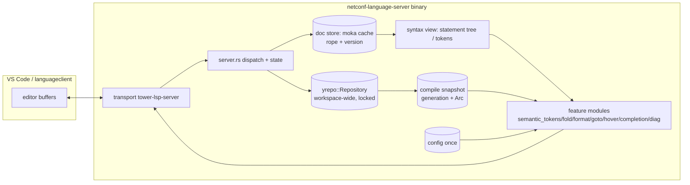

# NETCONF Language Server — Architecture

> As-built architecture & decision record for the **implemented** server (v0.3.0).
> The LSP features in §7–§8 are all shipped — fold, format, highlight, pull
> diagnostics, goto, hover, completion — and covered by unit + corpus tests
> (§11). Instance-document features (M0–M5: XML/JSON read+write, diagnostics
> depth, leaf value validation) are also shipped (see §12; decisions D18+ in
> §13). Status markers: **[DONE]** = settled &
> implemented, **[ASSUME]** = working assumption to confirm.

## 0. Scope

A Rust language server for authoring **NETCONF/YANG** modules (`*.yang`) **and
NETCONF instance documents** — XML message envelopes/payloads and RFC 7951 JSON
— plus **VS Code** and **Zed** extensions. The YANG-only v0.1.0 behaviors are unchanged;
instance features were shipped as milestones M0–M5 (see §12 and D18+ in §13).

- Reference implementation skeleton & Design lessons: **`gemcap-language-server`** (MIT — mirror freely).
- Semantic engine: **`yrepo`** (MIT crate, `0.3` on crates.io; used with its
  `parallel` feature). Grammar: `tree-sitter-yang` (transitively pulled in by `yrepo`).

Original LSP feature spec is preserved and re-mapped in §7–§8.

---

## 1. Layered model



### Responsibilities per crate

| Crate | Owns | Does NOT own |
| --- | --- | --- |
| `netconf-language-server` | LSP transport, document store, feature logic, config, VS Code glue | YANG grammar knowledge, semantic model |
| `yrepo` | parsing, statement/CST model, cross-file compile, symbol tables, effective tree | anything LSP-specific |
| `tree-sitter-yang` | the grammar | — |

**[DONE D2]** `yrepo` exposes the statement tree publicly; the server consumes it (hold the repo read-lock while borrowing):

- `Repository::statement(url) -> Option<&Statement>` — root `module`/`submodule` statement (walk with `Statement::preorder`).
- `Repository::statement_at(url, row, col) -> Option<&Statement>` — narrowest statement under the caret (read `.arg`/`.keyword` directly).
- `Statement`, `Argument`, `StatementEnd` re-exported (`range`/`keyword`/`arg`/`end`/`children` + `is_block`/`body`/`span`/`preorder`).

**[DONE D13-comments]** Comments are exposed too: `Repository::comments(url) -> Option<&[Comment]>` (`Comment{range, kind: Line|Block, text}`, source order, string-safe) — consumed by the formatter and highlight.

**[DONE]** The semantic layer also gained **type-chain & identity resolution**: `Library::resolve_type` / `resolve_identity` / `derived_identities` plus completion helpers `type_candidates` / `identity_candidates` (see §6.2, §8.4–8.5).

**[DONE D15-tokens]** The token stream is exposed too: `Repository::tokens(url) -> Option<&[Token]>` with `Token{kind: TokenKind, range, text}` — grammar-precise `Comment`/`Keyword`/`Identifier`/`String`/`Number`/`Boolean`/`Operator` leaves (see §5.1/§5.3). Highlight literal colors are driven straight from these. **No syntactic gap remains.**

---

## 2. Reference-project lessons

### 2.1 Adopt from gemcap (the template)

- **Layout**: single binary crate; one flat module per LSP feature exposing `capability()` + `handle(&doc, …)`; `server.rs` holds state and does only routing/cache-lookup/logging.
- **Deps**: `tower-lsp-server = "0.23"` (not legacy `tower-lsp`), `ropey`, `moka::future::Cache` as the document store, `tokio`, `serde`/`serde_json`, `toml`, `strum`. Already in `Cargo.toml`.
- **State without locks**: LSP handlers are `&self`; gemcap uses `OnceLock` + `moka Cache`. *Caveat:* our semantic layer is a single shared `yrepo::Repository`, so it needs a lock — see §6.
- **`client.rs`**: process-global `Client` in a `OnceCell`; `info!`/`warning!` macros routed to `window/logMessage`; `#![deny(clippy::print_stdout)]` / `print_stderr`.
- **Main**: `LspService::new(Server::new)` → `tower_lsp_server::Server::new(stdin, stdout, socket).serve(service).await`.
- **Pull diagnostics** (modern `textDocument/diagnostic`), not `publish_diagnostics`.
- **Client**: `clients/vscode` with vscode-languageclient 10, `configurationDefaults` enabling semantic highlight, bundled per-platform binary under `resources/bin/`, `__DEBUG_LSP_SERVER` env override for debugging against `target/debug/…`.

### 2.2 Adopt conceptually from other LSPs

- Single source of truth for grammar node kinds (typed enum mirroring grammar kinds, matched by `strum`) instead of stringly-typed walks.
- Features as traits implemented on a per-document model; one capability-assembly point.
- Stable **string diagnostic codes** (`DiagnosticCode::as_str()`, plus the LS-side `conflict_prefix`); doc-URL links and code-driven quick-fixes are deferred (D9).
- Careful LSP encoding: UTF-16 delta encoding for semantic tokens, multi-line token splitting, saturating offset math (line-0 underflow).
- File-lifecycle hygiene: on close, revert to the on-disk text or drop the doc from the repo (§4). A `workspace/didChangeWatchedFiles` re-scan is deferred (v1 scans the workspace once, §6.1).

### 2.3 Anti-patterns to avoid

- Blocking synchronous filesystem work inside async request paths.
- Coarse invalidation of the whole semantic cache on every keystroke (we get this handled differently — §6 full-workspace compile).
- No automated LSP-level tests. Tests shipped are **unit-level**: feature logic is driven against a scripted `yrepo` repository (`goto.rs`/`hover.rs`) plus the vendored highlight corpus (`semantic_token.rs`, §11). A full stdio JSON-RPC integration harness is still a future addition.

---

## 3. Crate / module layout (as built)

```text
netconf-language-server/
├── Cargo.toml              # tower-lsp-server 0.23, moka 0.12 (future), ropey 1.6,
│                           #   tokio, serde/serde_json, strum, regex,
│                           #   tree-sitter 0.26 + xml/json, yrepo 0.3 (registry, "parallel")
├── docs/architecture.md
├── src/
│   ├── main.rs             # transport boilerplate; deny print!; module decls
│   ├── server.rs           # Server: state (docs cache, repo, snapshot) + LanguageServer impl (routing)
│   ├── client.rs           # global Client holder; info!/warning! macros; Window::log;
│   │                       #   Workspace::configuration; Diagnostics::refresh
│   ├── config.rs           # Config (§9): netconf.indentSize
│   ├── convert.rs          # Rope byte offset <-> LSP line/UTF-16 conversion (byte/pos math)
│   ├── document.rs         # per-open-doc model: rope + version
│   ├── workspace.rs        # *.yang discovery, DocLang routing (Yang/Xml/Json/Other) + uri<->path
│   ├── semantic_token.rs   # highlight (two passes + delta encode + corpus tests)  [YANG-only]
│   ├── fold.rs             # statement-level folding                              [YANG-only]
│   ├── format.rs           # full-doc formatter (regenerate + splice comments)    [YANG-only]
│   ├── goto.rs             # YANG definition -> LocationLink (+ unit tests)
│   ├── hover.rs            # YANG hover markdown (+ unit tests)
│   ├── completion.rs       # YANG type / identity base completion (D16)
│   ├── diagnostic.rs       # YANG pull diagnostics + LS-side conflict-prefix (D17)
│   ├── schema_idx.rs       # compiled-module summaries (instance-doc sniffing) (M0)
│   ├── inst.rs             # instance intent classification (NETCONF vs dormant) (M0)
│   ├── xml.rs              # XML instance tree parse + leaf text (M0/M1)
│   ├── inst_map.rs         # XML element -> schema resolver + diags (+depth, M4)
│   ├── json.rs             # RFC 7951 JSON instance parse (M0/M3)
│   ├── jmap.rs             # JSON member -> schema resolver + diags (+depth, M4)
│   ├── depth.rs            # shared mandatory/key/choice analysis (M4)
│   ├── xcomp.rs            # XML element completion (M2)
│   ├── template.rs         # NETCONF envelope skeleton templates + insert command (M2)
│   ├── jcomp.rs            # JSON RFC 7951 member completion (M4)
│   └── valcheck.rs         # leaf value validation (scalar-only) + value defaults (M5)
├── clients/vscode/         # VS Code extension (mirror gemcap; yang+xml+json selectors, template commands)
├── clients/zed/            # Zed extension: same server, YANG/XML/JSON read + write
├── examples/               # *.yang + XML/JSON instance docs for manual testing
└── testdata/highlight/     # vendored YANG corpus + baseline.json (highlight regression guard)
```

Notes:

- No `text.rs`: byte↔line/UTF-16 math lives in `convert.rs` over each doc's `Rope`.
- No `action.rs`: quick-fixes are deferred (D9), so there is no `textDocument/codeAction`.
- Instance docs (XML/JSON) live in the doc cache only — they are **never** fed to
  `yrepo`; semantics route on `workspace::DocLang` (M0, D18–D25).

---

## 4. Document model & text sync

**[DONE D1]** — **FULL sync** (rope kept for byte↔line/UTF-16 math).

Per open document the server stores (mirroring gemcap's `Gemtext`):

```rust
// src/document.rs
struct Document {
    version: i32,
    rope: Rope,                 // offset math: byte <-> line / UTF-16 col (convert.rs)
    // structural/semantic/token views are fetched from yrepo per request, not stored here
}
```

Keyed in a `moka::future::Cache<String /*url*/, Arc<Document>>` (capacity 4096) on `Server.docs`.

- `Server` advertises `TextDocumentSyncKind::FULL`; `didChange` only accepts
  whole-document changes (a ranged change logs a warning and is ignored).
- `didOpen`/`didChange` call `upsert_doc`: they insert the `Document` **and**
  upsert the full source into `yrepo::Repository`, then bump the generation
  (§6.1) and ask the client to re-pull diagnostics (§7).
- `didClose` (`close_doc`) removes the buffer, re-upserts the **on-disk** text
  (so a closed module keeps resolving for others' imports) or removes the
  document from the repo when the file is gone, then bumps + refreshes.
- `rope_for(url)` returns the open buffer's rope, else reads the file from disk —
  used to map byte ranges of cross-file goto/hover targets that aren't open.

YANG modules are not typically megabytes, so a full re-parse per change is fine
and matches `yrepo`'s model (`upsert` always takes the full source anyway).

---

## 5. Syntax access for fold / format / highlight / precise goto-hover

**[DONE D2]** — adopted option **(A)**: `yrepo` exposes an immutable *syntax view*.

### 5.1 `yrepo` surface consumed by the server

```rust
// Repository (takes &self; borrows into the repo — hold the read-lock while extracting)
pub fn statement(&self, url: &str) -> Option<&Statement>;             // root module/submodule stmt
pub fn statement_at(&self, url: &str, row: usize, col: usize) -> Option<&Statement>;
// ^ narrowest statement under the caret, live tree: read .arg/.keyword/.children directly
pub fn comments(&self, url: &str) -> Option<&[Comment]>;              // source-ordered comments
// Comment { range, kind: Line|Block, text } — the statement tree does not model comments
pub fn tokens(&self, url: &str) -> Option<&[Token]>;                 // raw lexical stream (D15)
// Token { kind: TokenKind, range: Range<usize>, text: String }
//   TokenKind = Comment | Keyword | Identifier | String | Number | Boolean | Operator | Other

// syntax.rs (re-exported)
pub struct Statement { kind: StatementKind, range: Range<usize> /*whole node*/,
    keyword: Option<Range<usize>>, arg: Option<Argument>, end: Option<StatementEnd>,
    children: Vec<Statement> }
// helpers: find / find_one / narrowest_at(byte) / is_block() / body() / span() / preorder()
// Argument { range: Range<usize> /* raw span incl. quotes */, logical: String } -> name()/path()
// StatementEnd = Semicolon{ semi: Range } | Braces{ open: Range, close: Range }
```

### 5.2 Feature coverage now

| Feature | Consumes from `yrepo` | Status |
| --- | --- | --- |
| Fold | `statement()` → `preorder()` → `end: Braces{open,close}` | ✅ ready |
| Format | `statement()` tree + raw source + `comments()` | ✅ ready (strategy: D14) |
| Highlight | `statement()` (`keyword`/`arg`/`kind`) + `comments()` + `tokens()` | ✅ ready (tokens drive literal colors — D15) |
| Goto import/include/belongs-to/uses/type | `statement_at()` → caret stmt `.arg`; then `Library` | ✅ ready |
| Goto augment | `statement_at()` → arg path; `Library::resolve_abs_schema_node_id` | ✅ ready |
| Goto type → typedef / base → identity | `statement_at()` → arg; `search_*` / `resolve_type` / `resolve_identity` | ✅ ready |
| Hover prefixed arg / augment path | `statement_at()` → arg; `prefix_to_module` / `resolve_abs_schema_node_id` | ✅ ready |
| Hover type chain / identity ancestry | `resolve_type()` (typedef stack → builtin) / `resolve_identity()` | ✅ ready |
| Completion for `type` / `base` args | `type_candidates()` / `identity_candidates()` | ✅ shipped (§8.7) |
| Diagnostics | `Outcome.diagnostics` | ✅ ready |

### 5.3 Syntax view: complete — statements + comments + tokens

The server consumes all three syntactic layers from `yrepo` (no local scanner):

- `statement()` / `statement_at()` — the structural tree (§5.1);
- `comments()` — comments, source-ordered, string-safe;
- `tokens()` — **the grammar's raw lexical stream**: `Token{kind: TokenKind, range: byte Range, text}` with `TokenKind = Comment | Keyword | Identifier | String | Number | Boolean | Operator | Other` (`#[non_exhaustive]`). Disjoint, sorted, whitespace excluded. A quoted run is one `String` token (quotes included, never split → `"8080"` is a string, not a number); a `//` inside a string is part of the string; comments reappear here (a superset of `comments()`).

**[DONE D15]** — option **(b)** was implemented, so the local-scanner option **(a)** is **dropped**: highlight's literal colors come straight from `tokens()` (map `TokenKind` → semantic type), with **no grammar logic duplicated** in `netconf-language-server`. Only the byte→UTF-16 conversion (via our `Rope`) remains ours.

**[DONE D4]** — atomic/composite argument classification is settled (§8.3): `tokens()` supplies the literal kinds; `statement()` supplies keyword & atomic-argument spans; the remaining mapping (which semantic type to give each `Identifier`/`Keyword` by context) is the accepted D4 map in §8.3.

---

## 6. Semantic layer: `yrepo` Repository + Library

Server state — a **shared, workspace-wide** repository plus a cached compile snapshot:

```rust
// src/server.rs
struct Server {
    root_uri: OnceLock<Uri>,
    repo: tokio::sync::RwLock<yrepo::Repository>,  // open-closure repository (§6.1)
    catalog: RwLock<Option<Arc<yrepo::CatalogIndex>>>,  // header-only workspace index
    open_yang: RwLock<HashSet<String>>,  // urls of open YANG buffers (closure roots)
    docs: moka::future::Cache<String, Arc<Document>>,   // per-doc text (§4)
    config: OnceLock<Config>,                            // §9
    generation: AtomicU64,   // bumped on every repo-affecting event
    snap: RwLock<Option<Snapshot>>,
    scan: tokio::sync::OnceCell<()>,   // one-time workspace catalog build (§6.1)
}

struct Snapshot {           // immutable compile result, cached by generation
    generation: u64,
    lib: Option<Arc<yrepo::Library>>,
    diags: Vec<yrepo::Diagnostic>,
}
```

### 6.1 Who gets upserted — the OPEN CLOSURE

`yrepo` resolves imports/includes **only among documents you `upsert`**. Cross-file goto/hover/diagnostics therefore need, per open buffer, the modules it can actually reach — not the whole tree. Retention/compile cost scales with what the user is looking at, not with workspace size (the catalog+closure serving model; measurements in yrepo `docs/memory-findings.md`, design in `docs/serving-large-trees.md`). Implemented in `workspace.rs` + `server.rs` + `closure.rs`:

1. **Startup index** (`build_startup_index`, once via `Server.scan`/`ensure_startup_index`): walk the
   workspace, then build a parse-free basename index (`NameIndex`) and an empty catalog —
   **no header is parsed at startup** (measured 0.27–0.29 s on a 165k-file tree). Header parsing is
   deferred to on-demand closure resolution (`resolve` over the needed name's candidates, bounded and
   cached; a bounded prefix fallback covers declared names that differ from filenames), so the
   whole-tree header scan/`ReferenceIndex` stay lazy (see `docs/design-lazy-startup-catalog.md`).
2. **Open-closure sync** (`sync_open_closure`, on `didOpen`/`didChange`/
   `didClose` and after the catalog build): the repository is reconciled to
   contain exactly the open buffers (upserted full in `upsert_yang`) plus every
   on-disk module reachable through the catalog from their headers — imports
   and includes (submodules), honoring `revision-date` pins, plus the
   `belongs-to` parent of an open submodule (`closure::header_seeds` +
   `closure::closure_urls`). Reachable on-disk documents are parsed
   **text-light**; documents that left the closure are dropped. The sync is
   incremental: seeds come from already-parsed buffers, so a keystroke that
   does not change the header costs only a catalog BFS + `contains` checks.
3. **[DONE D5]** Imported modules *outside* the workspace (system YANG, `ietf-*`) are **ignored in v1**; their unresolved-import diagnostics are suppressed (configurable include dirs can come later).
4. **Serving trade-off**: diagnostics and cross-file features are computed over
   the open closure. Modules that exist on disk but are not reachable from any
   open buffer (e.g. augments whose source module nobody imported) do not
   appear — matching what an editor needs; the whole-tree scan it replaces is
   gone by design.

**Ordering.** Handlers mutate shared, cross-document state (open set,
repository, closure) and read it back (snapshot). tower-lsp dispatches
concurrently by default (no ordering between notifications or between
notifications and requests — tower-lsp-server#36), so the server runs at
`concurrency_level(1)`: every message is handled to completion in arrival
order, giving didOpen/didChange/didClose → feature-request the framework-level
serial guarantee the serving model relies on. Cost: `$/cancelRequest` cannot
preempt a running handler (handlers are quick; `snapshot()` is cached per
generation).

Because `compile()` is non-incremental and is CPU work on the request path, we cache its result:

- `snapshot()` returns the cached `Snapshot` when its `generation` equals the current `Server.generation`; otherwise it recompiles (`repo.read().await.compile()`), stores the new `Arc<Library>` + diagnostics, and caches them. v1 accepts a full recompile per change batch (small module counts are typical when authoring) and runs it on the request path under the repo read-lock — no `spawn_blocking` needed because compile is read-only against the repo.
- Every repo-affecting event (open/change/close, closure sync that adds/drops documents, catalog build) bumps `generation`, so the next semantic request rebuilds the snapshot; pull-diagnostics reuse it and key their `result_id` on the generation (§7).
- The immutable `Arc<Library>` snapshot is shared cheaply across concurrent requests; each request resolves goto/hover/completion against it (never against a half-compiled state).

### 6.2 API mapping (from `yrepo` README/report)

| Query | Use for |
| --- | --- |
| `Outcome.library` / `Outcome.diagnostics` | diagnostics + resolved cross-file features |
| `Library::module(name)` / `module_rev(name, rev)` | goto import arg → target module file (`ModuleRecord::source_urls()[0]`) |
| `Library::submodule(name)` | goto include / belongs-to arg → submodule file |
| `Library::search_grouping/type/identity(module, name)` | goto uses/type; hover on prefixed args |
| `Library::prefix_to_module(module, prefix)` | hover "which module is this prefix from" → show its import statement |
| `Library::resolve_abs_schema_node_id(module, path)` | goto/hover on augment/refine/deviation argument, per path segment |
| `Repository::statement(url)` | syntax root of a doc → fold/format/highlight walk (`preorder`) |
| `Repository::statement_at(url,row,col)` | caret → precise goto/hover (narrowest stmt; read `.arg`/`.keyword`) — supersedes `token_at` for features |
| `Repository::token_at(url,row,col)` | cheap kind/spot check only (`StatementKind` + `TokenSpot`, no arg text) |
| `ModuleRecord::imports/includes/…` | resolved header facts of a compiled module |
| `Repository::comments(url)` | comment spans/kinds for format, highlight, comment-out fix |
| `Library::resolve_type(module, type)` | `type` arg → typedef chain → builtin (`TypeResolution{builtin, typedefs, complete}`) |
| `Library::resolve_identity(module, name)` / `derived_identities(module, base)` | identity ancestry; identityref `base` value set |
| `Library::type_candidates(module)` / `identity_candidates(module)` | completion for `type` / `base` args (`TypeCandidate{name, kind, module}`) |
| `Typedef::base()` / `Identity::base()` | raw underlying `type` / `base` argument of a symbol |

The `resolve_*` / `*_candidates` / `comments` APIs all come from `yrepo` 0.3 (on crates.io); the `resolve_*` family needs a compiled `Library`, so the server always uses them behind the §6.1 compile snapshot.

Positions: `yrepo` speaks **byte offsets** keyed by the exact url passed to `upsert`; `row`/`col` in `token_at`/`statement_at` are 0-based with `col` in Unicode scalars, not UTF-16. All conversion to LSP `Range` happens in `netconf-language-server` (§8, `convert.rs`). `DiagnosticCode` and `StatementKind` are `#[non_exhaustive]` — exhaustive matches need a wildcard arm. `statement()`/`statement_at()` borrow the repository (read-lock) — extract what you need, then drop the guard.

---

## 7. Diagnostics & quick fixes (spec §6 → design)

User table, mapped onto `yrepo` codes and delivery mechanics:

| severity | scenario | `yrepo` code (if any) | LSP source | quick-fix |
| --- | --- | --- | --- | --- |
| error | circular chains of imports **or** includes | `ImportCycle` ✅ (yrepo, RFC 7950 §5.1) / `IncludeCycle` ✅ | yang | none (restructure imports) |
| error | import/include target not found | `UnresolvedImport` / `UnresolvedInclude` / `UnresolvedBelongsTo` | yang | none (comment-out deferred — D9) |
| error | undefined prefix | `UnresolvedPrefix` (emitted for augment targets + `type`/`base` prefix refs) — scope to confirm | yang | none |
| error | duplicated argument string among siblings (except augment?) | `DuplicateSymbol` (reserved) — **deferred** (D8: too complex with `choice`/`case`) | yang | none |
| error | conflict prefix | no yrepo code — two imports sharing one prefix; LS-side check (D17) | yang | none |
| — | syntax | `ParseError` | yang | none |

Plus `yrepo` extras already surfaced by compile: `DuplicateModule`, `NotYangDocument`, `UnresolvedGrouping` / `UnresolvedTypedef` / `UnresolvedIdentity` / `UnresolvedPrefix`, `IncludeCycle` / `ImportCycle` (both now emitted), `AugmentTargetNotFound`, `DeviationTargetNotFound`, `ListWithoutKey`/`KeyLeafNotFound`/`InvalidKey`, `MissingRevisionNote`. Still **reserved/unemitted**: `DuplicateSymbol`, `AugmentTargetNotUnique` (the former `ImportCycleNote` was renamed to `ImportCycle` and is now emitted).

**[DONE D17]** Remaining spec diagnostics implemented **LS-side** over `statement()`
in `diagnostic.rs::conflict_prefix`: **conflict prefix** — two `import` children
(or an `import` vs the module's own `prefix`) declaring the same prefix
(RFC 7950 §7.1.4), emitted with the stable code string `conflict_prefix`.
Circular-import reporting moved into `yrepo` (`ImportCycle`, D6); duplicate-siblings is **dropped** (D8).

**[DONE D6]** — **error** for circular *import* chains, now reported **by `yrepo`** as `ImportCycle` (RFC 7950 §5.1) — no LS-side DFS needed.

> **Q6 — "RFC allows some cycles"?** Correction: **RFC 7950 (YANG 1.1) §5.1 forbids them**: *"There MUST NOT be any circular chains of imports. For example, if module "a" imports module "b", "b" cannot import "a"."* My earlier note was wrong. The reason `yrepo` used to "compile" A↔B silently is mechanical: an `import` is a `prefix → module` mapping and name resolution is a lookup (never recursive expansion), so a cycle neither hangs nor confuses it — which is why it was never reported. That is now fixed: `yrepo` walks the module graph and emits `ImportCycle` (error) on the offending import. Include cycles were already errors (`IncludeCycle`). No structural quick-fix exists — the author must drop or redirect an import.

**[DONE D7]** Delivery model: **pull diagnostics** (`textDocument/diagnostic`).
`Server::diagnostic` first awaits the one-time workspace scan (§6.1), then serves
from the `snapshot()` cache with `result_id` = compile generation. yrepo
`Diagnostic`s are filtered per `url` and converted with that doc's rope (byte →
UTF-16 `Range`, `severity`, stable string `code` from `DiagnosticCode::as_str()`,
`source: "yang"`, message), then merged with the LS-side conflict-prefix check.
Because a pull client only re-requests on document change — never when the
*module set* changes — `client.rs::Diagnostics::refresh`
(`workspace/diagnostic/refresh`) is called after every open/close/scan so stale
cross-file results are replaced. No `publish_diagnostics`.

**[DONE D8]** **Skipped** — the "duplicated argument string among siblings" diagnostic is dropped. Sibling uniqueness is genuinely ambiguous once `choice`/`case` (incl. shorthand `case`s, RFC 7950 §7.9.2) and `uses`-expanded nodes are involved; not worth the complexity for v1. The spec row above is marked deferred.

**[DONE D9]** — **no quick-fixes in v1** (comment-out deferred): there is no
`action.rs` module and no `textDocument/codeAction` capability. If one ships
later it will follow the same quick-fix pattern — receive the client-provided
diagnostics in `CodeActionParams`, key off our stable diagnostic **code string**
(`DiagnosticCode::as_str()` / `conflict_prefix`), and return edits over the
diagnostic's range with no re-analysis.

---

## 8. Feature design (spec §1–§5 → handlers)

Each feature = one module implementing `capability()` + `handle(&doc, …)` (gemcap shape). All LSP handlers return `jsonrpc::Result<…>`.

### 8.1 Fold — `textDocument/foldingRange` (implemented — `src/fold.rs`)

Natural statement-level folds: walk `Repository::statement(url)` with `preorder()`; for each statement whose `end` is `StatementEnd::Braces{ open, close }` and whose body spans >1 line, emit a `FoldingRange{ kind: Region }` from `open`'s line to `close`'s line. Statements with `end: None` (broken parse) are skipped. Collect all ranges while holding the repo read-lock; convert byte→line via the doc `Rope`.

### 8.2 Format — `textDocument/formatting` (full-doc `TextEdit`) — implemented

**Implemented** in `src/format.rs` (regenerate-from-tree + splice comments, with
parse guards in `server.rs`); see the as-built note below the Q14 trade-off.

Rules from spec, restated as an indentation model over the statement tree:

1. indent +1 per nested block statement level (config: indent **spaces + size**, default 4 — **[DONE D10]**, no tabs);
2. `keyword` ⇄ `argument`: exactly 1 space;
3. block `{` separated from previous token by exactly 1 space;
4. line-feed after `{` and after `;` (each leaf/block statement on its own line);
5. `;` never separated from its previous token;
6. trailing whitespace trimmed.

Data: `Repository::statement(url)` (structure/spans) + doc source; pure syntax + config, no compile. Argument text must come from the **raw source slice** (`arg.range`), never the dequoted `logical` — quotes and internal line breaks are preserved verbatim. Since a format replaces the whole document, generate a **single full-range `TextEdit`**; range formatting can be v2.

Comment safety (**[DONE D14]** — regenerate-from-tree + splice): the statement tree drops comments, but `Repository::comments(url)` provides them (range/kind/text, source order), so a formatter never deletes them. Two strategies:

- **regenerate-from-tree + splice comments** — print each statement (leaf → `keyword [arg];`, block → header + children + `}`), then splice comments back at the right indentation using the `comments()` list (own-line comment → attach to the following statement; trailing comment after `;`/`}` → keep on the statement's line);
- **line-preserving** — never move text across lines; only fix leading indent, spacing around keyword/`{`/`;` and trailing whitespace, keyed to enclosing statement depth.

**As built** (`format.rs`): each statement is printed `indent keyword [arg];`
(leaf) or `header { … }` (block, children at depth+1). Argument text is copied
from the **raw source** (`arg.range`), never `logical`; comments from
`comments()` are spliced back — before the root, inside each body (interleaved
with children by byte position; `direct_comments` skips comments that fall
inside a child's span), and after the root — at the owning block's indent. Empty
block bodies collapse to `{ }`; trailing blank lines are trimmed.

`server.rs` guards **both ends** with a scratch `yrepo` compile
(`syntax_broken`): formatting is skipped when the current source **or** the
reformatted result carries a `ParseError`/`NotYangDocument`, so a syntax error
can never be reshaped into something worse. Success replaces the whole document
with a single full-range `TextEdit`.

> **Q14 — regenerate-from-tree + splice vs line-preserving**
>
> **regenerate-from-tree + splice comments**
>
> - ✅ enforces *every* formatting rule by construction (statement = `indent keyword [arg];`, block = header + `{` + children + `}`), so messy input (several statements on one line, split lines, odd spacing) is normalized to the canonical layout;
> - ✅ deterministic output → stable, minimal churn between format runs;
> - ❌ must re-associate comments (own-line vs trailing) from the `comments()` list — edge cases: a comment right before the `}` of an empty block, a comment above the module header's first statement, a `/* … */` block in the middle of a body;
> - ❌ argument text must be copied from the **raw source** (`arg.range`), never `logical`, or quotes / `+`-concatenations / multi-line strings get mangled;
> - ❌ rewrites the whole file → bigger diff and it can move the cursor/folds if invoked casually (mitigate: run only on explicit Format Document / save).
>
> **line-preserving**
>
> - ✅ safe & local: only fixes leading indent, spacing around `keyword`/`{`/`;`, trailing whitespace; never moves text across lines, so comments, strings and user layout can't be lost — no comment re-association logic at all;
> - ✅ small diffs, non-disruptive;
> - ❌ cannot fix structural layout: two statements on one line stay on one line, a misplaced `{` can't be moved onto its own line — spec rules 3–4 are *improved*, not guaranteed;
> - ❌ still needs the statement tree for per-line indent, and the result depends on the original layout (not canonical/idempotent).
>
> Lean stays **regenerate-from-tree + splice** for v1: the spec's rules are about statement *layout* (spacing + line breaks), which only full regeneration guarantees.

### 8.3 Highlight — `textDocument/semanticTokens/full` (implemented — `src/semantic_token.rs`)

Data: `Repository::statement(url)` gives `keyword`/`arg` spans + `StatementKind`;
`Repository::tokens(url)` supplies the lexical literals (**DONE D15**). Semantic
tokens must be **disjoint and sorted**, so color in two complementary passes
(per-`StatementKind` classes and the whole-argument overrides are in the "As
built" block after the Q4 note below):

1. **structural** — over `preorder()` statements: each `keyword` span → a
   `keyword` token, plus one token over each *atomic* argument span (class by
   `StatementKind`); *composite* args get **no** whole-arg token;
2. **lexical** — from `tokens()`: `Comment` and `Boolean` anywhere → their class;
   `String`/`Number`/`Operator`/`Keyword` tokens only when inside a *composite*
   argument span.

This yields the spec's scheme: distinct colors for `comment`, `+`, number
literal, quoted string literal, `true`/`false` over the base keyword+argument
pattern.

> **Q4 — what are "atomic" vs "composite" arguments?** Every statement is `keyword argument;`; the *argument is one textual span*, but semantically it is either a **name/reference** or a **literal value**, and that decides how we color it (semantic tokens must not overlap):
>
> - **Atomic** = the argument is a single identifier / identifier-ref → emit **one token over the whole `arg.range`**, typed by the statement. E.g.
>
>   ```yang
>   leaf hostname { type string; }          // "hostname" (name), "string" (type name)
>   container system { }                   // "system" (name)
>   import ietf-yang-types { prefix yang; }// module name; "yang" a prefix (name)
>   uses l3:ipv4-top;                      // grouping ref: prefix "l3" + name
>   identity eth { base b:iface; }         // identity/base refs are atomic names too
>   ```
>
> - **Composite** = the argument is a *value whose text contains quoted strings, numbers, booleans or `+`* → emit **no whole-arg token**; the lexical pass colors the pieces. E.g.
>
>   ```yang
>   namespace "urn:example:sys";           // quoted string
>   description "fast " + "ethernet";      // two strings + the "+" operator
>   pattern "[0-9a-fA-F]+";                // quoted regex -> string
>   range "1..4094";  value 7;  fraction-digits 2;   // numbers
>   config true;  mandatory false;         // booleans -> keyword (+readonly)
>   ```
>
> **[DONE D4]** — settled (atomic = one token over the arg; composite = lex the
> inside). The shipped map is a **richer** per-`StatementKind` classification with
> whole-argument overrides — see the as-built table below §8.3.

**As built** (`src/semantic_token.rs`): two passes emit disjoint, sorted items that are delta-encoded to LSP tokens. Classification is decided **per role** (a `Role` per construct family): every role is a member of the `netconf.semantic` object, and `Style::from_settings(netconf.semantic)` resolves each role to a `(class, modifier-bits)` — the configured token type (any standard `SemanticTokenType`) and modifiers, or the role's built-in ones when unconfigured — at `semantic_tokens_full` time. Pass 1 colors every statement `keyword` plus atomic args (one token over `arg.range`), assigned a role by `role_of_kind(kind)`:

| role (config key) | built-in class | atomic args / whole-arg use |
| --- | --- | --- |
| `moduleName` | `namespace` | `module`/`submodule`/`import`/`include`/`belongs-to`/`prefix` args |
| `typeRef` | `type` | `type`/`uses`/`base`/`refine` args (identifier & `prefix:name` refs) |
| `deviateVerb` | `keyword` | the `deviate` verb args (`add`/`replace`/`delete`/`not-supported`) |
| `dateString`, `rangeLength`, `keyUniqueAugment` | `string` | `revision`/`revision-date` dates; `range`/`length` args whole; `key`/`unique` member lists, (un)quoted `augment` paths |
| `patternArg` | `regexp` | `pattern` quoted args whole (the argument is a regex string) |
| `dataNodeName` | `variable` | data-node names: `container`/`leaf`/`leaf-list`/`list`/`choice`/`case`/`anyxml`/`anydata`/`rpc`/`action`/`notification` args |
| `definitionName` | `variable` | definition names: `grouping`/`typedef`/`identity`/`feature`/`extension` args |
| `enumAndBitNames` | `variable` | `bit`/`enum` names |

Whole-argument roles (`whole_arg_role`) before the composite fallback: `numberArgument` for a bare (unquoted) signed number (`default -10;`, `value -1;`) → `number`; `referenceWord` for an unquoted single word under `if-feature`/`default`/`argument`/`namespace` → `variable`; `vendorExtension` for unquoted `Unknown` (vendor extension) args → `variable`; `units` for unquoted `units` values → `variable` **+ `readonly`** (the const proxy — LSP has no `const` tag). Composite args get **no** whole-arg token; pass 2 colors their inside. The remaining roles (`comment`, `stringLiteral`, `numberLiteral`, `boolean`, `valueKeyword`, `operator`) cover the lexical pass. Because the legend announces the full standard set, a user can retarget **any** role to **any** token type and add **any** modifiers; unconfigured roles keep their built-in `(class, modifier-bits)`.

**Deprecation (always-on, cross-cutting).** Any declaration whose direct child is a `status deprecated;` statement (`StatementKind::Status`, arg `deprecated`) gets the standard **`deprecated`** modifier OR'd into every token of its **whole subtree** — keyword, name, the `status deprecated;` marker's own words, and descendants (`handle` records the owning statement's byte range and ORs the bit after overlap-drop). `status obsolete;` has no standard modifier and is left unmarked.

Pass 2 — lexical over `tokens()`: `Comment` anywhere and `Boolean` literals
anywhere get their class; `String`/`Number`/`Operator`/`Keyword` tokens are
colored only when inside a composite span (so pass-1 statement keywords are never
double-colored). Value keywords such as `status deprecated`, `ordered-by user`
and `min`/`max` are colored this way.

Legend order (`Class::ALL`, the **full standard `SemanticTokenType` set**):
`namespace`, `type`, `class`, `enum`, `interface`, `struct`, `typeParameter`,
`parameter`, `variable`, `property`, `enumMember`, `event`, `function`,
`method`, `macro`, `keyword`, `modifier`, `comment`, `string`, `number`,
`regexp`, `operator`, `decorator`; modifiers (`Modifier::ALL`, the full standard
`SemanticTokenModifier` set): `declaration`, `definition`, `readonly`, `static`,
`deprecated`, `abstract`, `async`, `modification`, `documentation`,
`defaultLibrary`. Since every standard type/modifier is announced up front, any
`netconf.semantic` per-role choice applies with no client restart (the legend
is immutable per session). Encoding pitfalls (see §2),
as built: byte ranges → UTF-16 deltas
(`delta_line`/`delta_start`); **every** multi-line token (long strings, `/* … */`
comments) is split into one token per line; items sorted then overlaps dropped;
`result_id` = doc version. Capability advertises `full` only (`SemanticTokensOptions`, no delta/range). Highlight behavior is pinned by the vendored `testdata/highlight` corpus + `baseline.json` (0 uncovered word tokens), the per-shape assertions in `semantic_token::tests`, and per-role/per-modifier tests. Config: `netconf.semantic` (per-role `token` + `modifiers` struct) in `src/config.rs` (§11).

### 8.4 Goto — `textDocument/definition` (implemented — `src/goto.rs`)

Two stages:

1. **Caret context**: LSP position → byte (`convert::position_to_byte` over the doc rope), then the narrowest statement under it (`Repository::statement(url)` + `narrowest_at(byte)`, the same tree `statement_at(url,row,col)` exposes); check the caret is within the statement's `arg.range` (for extension usages, within the head `keyword`), then read `arg.name()` / `arg.path()` for the prefixed identifier / schema-nodeid.
2. **Resolve** via `Library`:

| trigger (arg of) | resolve to | return |
| --- | --- | --- |
| `import` / `belongs-to` | `Library::module(arg)` | target module's file top (`ModuleRecord::source_urls()[0]`) |
| `include` | `Library::submodule(arg)` | submodule file top |
| `uses [prefix:]g` | `search_grouping(module_of_prefix, g)` | `Grouping.defining` |
| `type [prefix:]t` | builtin name → nothing; else `search_type` | `Typedef.defining` |
| `base [prefix:]id` (identity) | `search_identity` | `Identity.defining` |
| `if-feature [prefix:]f` | `search_feature(module_of_prefix, f)` | `Feature.defining` |
| `default` value | identity (identityref leaves) via `search_identity`, else the enum member of the owning leaf/leaf-list/typedef's `type enumeration` | `Identity.defining` / enum arg range |
| extension head `p:name` (`Unknown`) | `search_extension(module_of_prefix, name)` on the caret's `keyword` | `Extension.defining` |
| `augment /path` | `resolve_abs_schema_node_id` on each segment | target node's `defining` |

**[DONE D11]** — returns **`LocationLink`**s. `goto::resolve` produces
`Target{url, target_range, origin_range}` (byte ranges) for the statement under
the caret (`root.narrowest_at(byte)`; extension usages resolve on the `keyword`
rather than the `arg`), and `goto::to_links` maps them with the **target file's
own** text — `server::rope_for`: open buffer or disk read — so the target
selection range points at the exact `defining` span, with `origin_selection_range`
set to the source argument span. Builtin `type` names are skipped. Unit tests in
`goto.rs` cover extension-usage and `if-feature`/`default` jumps.

Cross-file targets that are **not open** must still be resolvable → they must be present in the repository (§6.1 workspace scanning).

### 8.5 Hover — `textDocument/hover` (implemented — `src/hover.rs`)

Markdown content built from the compiled `Library` (+ raw source for import
snippets), assembled from ranges of the defining sources (open buffer or on-disk
read). The caret statement is located by byte (`root.narrowest_at(byte)`), and a
hover is produced when the caret sits in the argument (or, for extension usages,
on the `p:name` head keyword). Shipped behaviors:

- **Prefixed reference** (`type p:t` / `base p:id`, or the prefix token):
  `prefix_to_module(scope, p)` → "prefix **`p`** → module **`m`**", plus the
  `import` statement source that binds it — fenced as a ```yang code block so the
  client syntax-highlights it — or "this module's own prefix".
- **`type` argument (non-builtin)**: `resolve_type(scope, name)` → typedef chain
  (`typedefs` stack with modules) and the builtin it bottoms out at; an
  incomplete chain is flagged.
- **identity `base` / `identityref`**: `resolve_identity` → `root` + `bases` ancestry.
- **`import` module**: module name + namespace + prefix.
- **`if-feature`**: feature name + owning module.
- **`uses`**: grouping name + defining module (prefixed form shows the prefix binding).
- **`augment /path`**: `resolve_abs_schema_node_id` → "target node `<name>` (kind: …)".
- **`default`**: identity value (identityref leaves) vs an enum member of the
  owning leaf/leaf-list/typedef's enumeration.
- **extension usage head** (`Unknown`): extension name, module, and `argument`.

Unit tests in `hover.rs` cover extension usage and `if-feature`/`default` hovers.
`derived_identities` value hints are not shown in v1.

### 8.6 Diagnostic / Action (implemented — `src/diagnostic.rs`)

See §7. `diagnostic.rs` implements the pull handler: `Server::diagnostic` awaits
the one-time workspace scan, takes the `snapshot()` (holding the current
`Arc<Library>` + `Outcome.diagnostics` — no `spawn_blocking`; compile runs under
the repo read-lock on a cache miss), converts that document's diagnostics
(`convert`, filtered by `url`) with its rope, and appends the LS-side
conflict-prefix check (`conflict_prefix`, code string `conflict_prefix`).
`action.rs` / `textDocument/codeAction` is **deferred (D9)** — no quick-fixes in v1.

### 8.7 Completion — `textDocument/completion` (implemented — `src/completion.rs`, D16)

Backed by `yrepo`'s `Library::{type,identity}_candidates`. Capability advertises
`trigger_characters: [":"]` — refreshing prefix-qualified candidates as the user
types a prefix — otherwise it triggers purely on the statement context.

- **Trigger context**: `root.narrowest_at(byte)` with the caret inside the
  statement's `arg.range`; only `type` and `base` statements produce items
  (detection mirrors goto/hover).
- **`type` argument** → `Library::type_candidates(scope)`. Items:
  `TypeCandidate{name, kind: Builtin|Typedef, module}` →
  `CompletionItemKind::TypeParameter` for builtins vs `STRUCT` for typedefs;
  `detail` = "built-in" or `"<module> (typedef)"`.
- **`base` argument** → `Library::identity_candidates(scope)` → `ENUM` items with
  `detail: "identity"`.
- Cross-module prefix-qualification of candidate names is left to `yrepo`'s
  candidate naming.

---

## 9. Configuration

**[DONE D10/D12]** `src/config.rs`, deserialized from the client settings section
**`netconf`** (VS Code properties are camelCase). Read on `initialized()` via
`workspace/configuration` and pushed by the extension on `netconf` setting
changes through `workspace/didChangeConfiguration`; `Server.config` is a
`OnceLock<Config>` that falls back to defaults before the first fetch. The
section may later grow `rpc` (XML) / `restconf` (JSON) languages under the same roof.

```rust
// src/config.rs
#[derive(Deserialize, Default, Debug, Clone)]
pub(crate) struct Config {
    /// netconf.indentSize — spaces per indent level (default 4, clamped 1..=16).
    #[serde(rename = "indentSize", default)]
    indent_size: Option<u8>,
}
```

Only `indentSize` ships in v1 (spaces only; no tab style / `indentStyle`).
Future keys: include dirs for out-of-workspace YANG, diagnostics toggles.

---

## 10. VS Code client

`clients/vscode` — extension name/id `netconf` (publisher `k19`, v0.1.0), mirrors gemcap:

- language id `yang`, `extensions: [".yang"]`, activation `onStartupFinished`;
  `configurationDefaults: { "[yang]": { "editor.semanticHighlighting.enabled": true } }`.
- settings section `netconf` ([DONE D12]); a `didChangeConfiguration` handler
  forwards `netconf` setting changes to the server.
- `vscode-languageclient` ^10.1; server resolution (`find_language_server`):
  1. the `__DEBUG_LSP_SERVER` env override (used by `.vscode/launch.json` against
     `target/debug/netconf-language-server`), else 2. the bundled per-platform
     binary `resources/bin/netconf-language-server-<platform>`; shows an error
     when neither exists.
- **single workspace folder** only: multiple folders, or none, → the client
  refuses to start (the server scans one root URI, §6.1).
- debug: F5 `Debug Extension` runs the `npm: build-server-and-client`
  preLaunchTask (`cargo build` + `npm run compile`) then launches an Extension
  Development Host; an `Attach to LSP server` lldb config is also provided.

Pull diagnostics require client support (`textDocument/diagnostic`) —
vscode-languageclient 10 handles it; no manual `publishDiagnostics`.

### Zed client (`clients/zed`)

The same server also ships as a **Zed** extension (`clients/zed`, id `Netconf`,
v0.0.1): it attaches the `netconf-language-server` binary to Zed's YANG / XML /
JSON languages and exposes the same **read** (diagnostics & hover) and **write**
(completion) features — see `clients/zed/README.md` (screenshots under
`assets/images/netconf-zed-*.png`).

---

## 11. Cross-cutting concerns

- **Positions**: `convert.rs` — `yrepo` byte ranges ↔ `lsp::Range` (UTF-16) via per-doc `Rope` (`byte_to_position`/`range_to_lsp`/`position_to_byte`/`utf16_len`). Careful: `row`/`col` in `token_at`/`statement_at` count Unicode scalars, not UTF-16; do not feed UTF-16 cols straight in. Multi-byte cursor positions clamp to the character start.
- **`#[non_exhaustive]`** on `StatementKind`, `DiagnosticCode` → wildcard arms (`K::Unknown(_)` / `_`) in goto/hover/highlight/diagnostic.
- **Non-goals v1**: `.yin`, network/`yangcatalog` fetch, *leafref / `instance-identifier` XPath resolution* (and leafref value *chasing*, D31 — scalar leaf *value* checks are in, M5), full deviation add/delete/replace semantics, incremental repo compile, multi-workspace-folder. *(Type-chain & identity-derivation existence resolution and the leaf restriction facets now come from `yrepo`; `union` values are deliberately not checked, D31.)*
- **Logging** discipline as gemcap (window/logMessage only via `client.rs`; `#![deny(clippy::print_stdout)]`/`print_stderr`). Errors surfaced as LSP errors, never panics on user content.
- **Tests**: unit tests in `goto.rs`/`hover.rs` over a scripted `yrepo` repository, plus the `semantic_token.rs` suite — delta-decode helpers, multi-line token splitting, per-shape assertions (`highlight_known_shapes_are_covered`) and a **coverage regression guard** over the vendored `testdata/highlight` corpus (`highlight_coverage_matches_baseline` vs `baseline.json`: 7 files, 275 word tokens, 0 uncovered; re-bless with the ignored `bless_highlight_baseline`). Dev tools for auditing `yrepo` over a tree / single file (`inspect`/`probe`) and profiling it (`perf`, time + RSS) live in the sibling `yrepo` crate as `examples/`. A full stdio JSON-RPC integration harness is still future work.

---

## 12. Implementation status

All nine proposal milestones are **shipped** (v0.1.0); each feature lives in its
own module behind a `capability()` + `handle(…)` shape and is dispatched from
`server.rs`:

| # | Workstream | Where | Notes |
| --- | --- | --- | --- |
| 1 | Skeleton / state / routing | `main.rs`/`server.rs`/`client.rs`/`config.rs` | FULL-sync doc store, log macros, config fetch, one-time scan |
| 2 | Position layer | `convert.rs` | byte ↔ line/UTF-16 over the doc `Rope` |
| 3 | Semantic tokens | `semantic_token.rs` | two passes + delta encode + corpus guard |
| 4 | Folding | `fold.rs` | statement `{…}` region folds |
| 5 | Formatting | `format.rs` | regenerate + splice comments, parse guards |
| 6 | Diagnostics | `diagnostic.rs` + `workspace.rs` | pull + `refresh`, workspace scan, conflict-prefix |
| 7 | Goto / Hover | `goto.rs`/`hover.rs` | against the §6.1 `Library` snapshot |
| 8 | Completion | `completion.rs` | `type` / identity `base` args |
| 9 | VS Code client & tooling | `clients/vscode`, `.vscode/*` | F5 extension debugging (yrepo audit/perf tools now live in `yrepo/examples/`) |

### Instance documents (M0–M5)

A second feature family, routed by `workspace::DocLang`; the YANG path above is
untouched (D24/D25).

| Ms | Feature | Where |
| --- | --- | --- |
| M0 | routing + intent classification (recognized vs dormant) | `workspace.rs` (`DocLang`), `inst.rs`, `xml.rs`/`json.rs` roots, `schema_idx.rs` |
| M1 | XML **read**: goto / hover / diagnostics on elements | `xml.rs`, `inst_map.rs` |
| M2 | XML **write**: NETCONF templates + element completion | `template.rs`, `xcomp.rs` + `workspace/executeCommand` |
| M3 | JSON **read** (RFC 7951): goto / hover / diagnostics on members | `json.rs`, `jmap.rs` |
| M4 | JSON completion + diagnostics depth (mandatory/key/choice) | `jcomp.rs`, `depth.rs` (XML + JSON) |
| M5 | leaf **value** validation (scalar-only, `union` silent) + typed defaults | `valcheck.rs` + yrepo value typing |

Deferred (not shipped in v1): quick-fixes/`codeAction` (D9),
`didChangeWatchedFiles` re-scan on external file changes, range formatting,
incremental repo compile, out-of-workspace include dirs, multi-workspace-folder.
From the instance work: leafref value *chasing* and fully-semantic
`instance-identifier` (D31), envelope goto modeling (D28 mechanism). See
`TODO.md` for deferred navigation/highlight ideas.

---

## 13. Decision log (summary)

All decisions are settled; unless noted, they are implemented in the shipped
server. Status markers match the sections above.

| # | Topic | Options | Status / lean |
| --- | --- | --- | --- |
| D1 | Text sync | FULL vs INCREMENTAL | ✅ **FULL v1** |
| D2 | Syntax view source | (A) extend `yrepo` / (B) own tree-sitter / (C) targeted APIs | ✅ **DONE** (A) — consumed from `yrepo` 0.3 |
| D3 | compile trigger/caching | lazy `spawn_blocking` + `Arc<Library>` snapshot | ✅ **done** — generation-keyed `snapshot()` cache (§6.1) |
| D4 | Highlight arg classes (Q4) | atomic = 1 token over arg / composite = lex inside; per-`StatementKind` map | ✅ **DONE** (map in §8.3) |
| D5 | Out-of-workspace imports | ignore v1 vs include dirs | ✅ ignore in v1 |
| D6 | Circular import chains | error vs warn — **RFC 7950 §5.1 forbids** (Q6) | ✅ error — via yrepo `ImportCycle` |
| D7 | Diagnostics delivery | pull vs push | ✅ **pull** |
| D8 | Duplicate-sibling diagnostic | define statement set | ✅ **skip** (choice/case complexity) |
| D9 | Quick-fix / comment-out | none vs `//`/`/* */` | ✅ **none in v1** |
| D10 | Indent style config | spaces only vs tabs | ✅ spaces+size |
| D11 | Goto return form | LocationLink vs Location | ✅ **LocationLink** |
| D12 | Config/extension section id | `yang` vs `netconf` | ✅ **`netconf`** (future rpc/restconf) |
| D13 | Comment spans | (a) local scanner / (b) expose from `yrepo` | ✅ **DONE** (b) `comments()` |
| D14 | Formatter strategy | regenerate-from-tree + comment splice vs line-preserving | ✅ **regenerate + splice** |
| D15 | Intra-arg literal spans (highlight) | (a) local scanner / (b) `tokens()` | ✅ **DONE** (b) — `tokens()` |
| D16 | Completion for `type`/`base` args | add to scope vs later | ✅ **done** — §8.7 |
| D17 | LS-side diags | conflict-prefix only (import-cycle now in yrepo; dup-sibling dropped D8) | ✅ **done** — `conflict_prefix` (`diagnostic.rs`) |
| D18 | JSON scope (M3/M4) | RFC 7951 instance/config docs; RESTCONF HTTP out of scope | ✅ **LOCKED** — shipped M3/M4 |
| D19 | File recognition | content-sniffing vs compiled library; no in-file markers | ✅ **LOCKED** (M0) |
| D20 | Format order | XML end-to-end first, then JSON | ✅ **LOCKED** (M1–M3) |
| D21 | NETCONF envelope schema | hard-coded in server | ✅ **LOCKED** — Rust consts (`template.rs`; ops in `xcomp`) |
| D22 | Instance parsing | `tree-sitter-xml` + `tree-sitter-json` | ✅ **LOCKED** (M0) |
| D23 | Workspace model | single folder; unmatched docs dormant | ✅ **LOCKED** |
| D24 | Server modules | `inst`/`xml`/`json`/`schema_idx`/`inst_map`/`jmap`/`xcomp`/`jcomp`/`template`/`depth`/`valcheck` (see §3) | ✅ **LOCKED** — all shipped M0–M5 |
| D25 | Capability scoping | tokens/fold/format stay YANG-only; others per-doc `null` | ✅ **LOCKED** |
| D26 | Dormant behavior | silent vs info diagnostic | **[OPEN]** — currently silent |
| D27 | Diag depth + leaf type-check | depth shipped M4 (mandatory/key/choice, XML+JSON); leaf *value* scope → D31 (M5) | ✅ **M4/M5** |
| D28 | Envelope representation | embedded YANG module vs Rust table | **[OPEN]** — Rust const table in use today |
| D29 | Where the data↔schema flattening lives | new `yrepo` APIs (`data_children`/`data_child`/`rpc_input`/`rpc_output`/`modules_by_namespace`); no LS-side schema-walk duplication | ✅ **LOCKED (a)** — yrepo (detail: §14) |
| D30 | Identifier spaces | XML keys on **namespace URI**, JSON on **module name** (RFC 7951 §4), schema-nodeids on scoped prefix; per-node **instance-namespace owner** (`SchemaNode::instance_module`) ≠ `origin_module` for grouping-born nodes | ✅ **LOCKED (a)** — yrepo (§14) |
| D31 | Leaf *value* checking scope | scalar-reducible only (typedef chain → builtin): `length`/`pattern`, `range`, `enumeration`/`bits`; semantic `identityref`; **`union` fully silent** (RFC 7950 §9.12) | ✅ **LOCKED (M5)** — leafref chase deferred |

**D18–D31** are the instance-document decisions (milestones M0–M5, §12) and
reflect the shipped state; the `yrepo` additions backing D29–D31 are summarized
in §14 and documented in `yrepo`'s own docs.

Q&A (answered inline):

- **Q4** — atomic vs composite arguments: §8.3 (Highlight) — examples + settled map (D4).

- **Q6** — "RFC allows some cycles?": §7 (D6) — RFC 7950 §5.1 forbids circular import chains.

- **Q14** — formatter strategy pros/cons: §8.2 (Format).

- **Q15** — what `tokens()` means (now implemented): §5.3 (D15).

---

## 14. D29–D31 backing — `yrepo` additions (instance data + value typing)

The LS decisions D29–D31 are implemented as read-only queries in `yrepo`
(tracked there as its own D18/D19), so instance mapping needs no LS-side
schema-walk duplication. The `yrepo` surface the instance code consumes:

- `NodeKind::is_data()` / `is_wrapper()` — data kinds vs the schema-only
  wrappers (`choice`/`case`/`input`/`output`) that never appear in an instance
  document.
- `SchemaNode::instance_module()` — the module whose **namespace** owns the
  node in instance data; equals `origin_module` except for nodes instantiated
  from a grouping via `uses` (RFC 7950 §7.13). `origin_module` stays the
  definition module for goto. `SchemaNode::type_facets()` — facets written on
  the node's own `type` statement.
- `ModuleRecord::data_children(id)` / `data_child(id, name)` — instance-visible
  children through `choice`/`case` wrappers (data path ≠ schema path);
  `rpc_input(id)` / `rpc_output(id)` are always present.
- `Library::modules_by_namespace(ns)` — XML element-ns → module(s);
  `Library::schema_nodeid(module, id)` — canonical wrapper-inclusive absolute
  nodeid, each segment prefixed by its instance module (D30).
- Leaf **value typing** (D31): the compiler captures a `type` statement's
  facets (`TypeFacets`) on the leaf **and** each typedef; `Library::value_type`
  reduces a leaf/leaf-list type through the typedef chain to a scalar
  `ValueType` (string `length`/`pattern`, integer widths + `range`, `decimal64`,
  `enumeration`/`bits` members, `leafref` `path`, `identityref` `base`) or a
  coarse kind (`Leafref`/`Identityref`/`InstanceIdentifier`/`Union`/`Unknown`).
  `union` is deliberately **not** checked (RFC 7950 §9.12);
  `Library::check_identityref` gives semantic `identityref` membership
  (`IdentityStatus`).

Each is covered by `yrepo` tests; the same material is documented in `yrepo`'s
own README/architecture (its decisions D18/D19).
